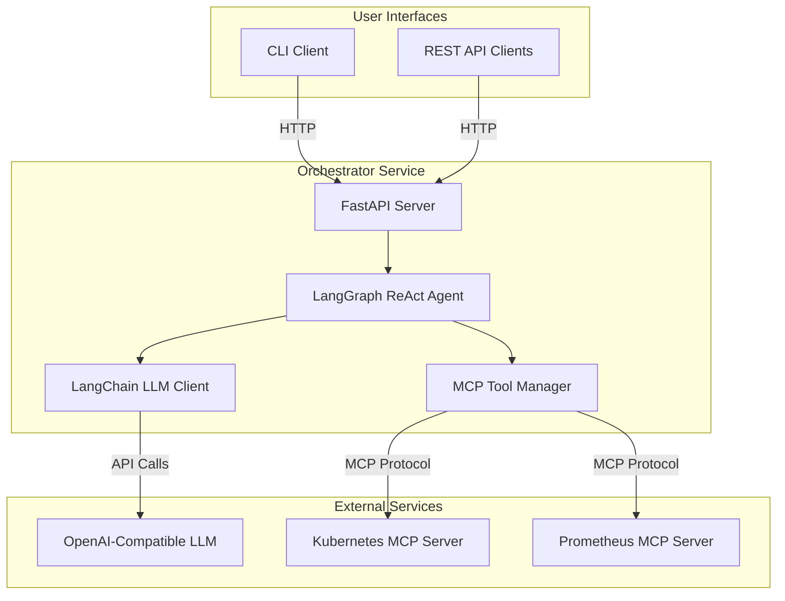

# SRE Orchestrator

An intelligent incident investigation system that acts as a virtual SRE engineer. The orchestrator uses LangGraph and LangChain to autonomously investigate production incidents by leveraging MCP (Model Context Protocol) tools to gather evidence from Kubernetes clusters and other systems.

## Overview

The SRE Orchestrator automates incident investigation by:

1. **Understanding Incidents**: Uses LLM-powered analysis to understand incident descriptions
2. **Autonomous Investigation**: LangGraph ReAct agent decides which tools to use and when
3. **Evidence Collection**: Gathers data from Kubernetes, Prometheus, and other systems via MCP tools
4. **Root Cause Analysis**: Correlates evidence to determine root causes with confidence levels
5. **Actionable Recommendations**: Provides specific steps to resolve issues

## Architecture



## Key Features

- **LangGraph ReAct Agent**: Autonomous investigation using reasoning and action loops
- **MCP Tool Integration**: Extensible tool system via Model Context Protocol
- **OpenAI-Compatible LLMs**: Works with OpenAI, Gemini, and local LLMs
- **Interactive CLI**: Natural language interface for incident investigation
- **REST API**: Programmatic access for integrations
- **Kubernetes Native**: Deploys alongside your applications

## Technology Stack

- **Python 3.12**: Core language
- **FastAPI**: REST API framework
- **LangGraph**: Agent workflow orchestration
- **LangChain**: LLM integration framework
- **MCP**: Tool protocol for external system integration
- **Kubernetes**: Container orchestration
- **Helm**: Deployment management

## Quick Start

### Prerequisites

- Kubernetes cluster (1.34+)
- Helm 3.19+
- OpenAI-compatible LLM API access (OpenAI, Gemini, or local LLM)

### 1. Deploy Kubernetes MCP Server

The orchestrator requires MCP servers to gather data. Start with the Kubernetes MCP server:

```bash
# Clone the MCP server repository
git clone -b helm-charts https://github.com/Andrea-Campanella/mcp-server-kubernetes.git
cd mcp-server-kubernetes

# Install the Helm chart
helm install msk charts/mcp-server-kubernetes/ \
  --namespace msk \
  --create-namespace
```

Verify the MCP server is running:

```bash
kubectl get pods -n msk
kubectl port-forward -n msk svc/msk-mcp-server-kubernetes 3000:3000

# Test the server
curl -X POST http://localhost:3000/mcp \
  -H "Content-Type: application/json" \
  -d '{"jsonrpc":"2.0","id":1,"method":"tools/list"}'
```

### 2. Deploy SRE Orchestrator

```bash
# Set your LLM API key
export LLM_API_KEY=your-api-key-here

# Install the orchestrator
helm install sre-orchestrator oci://ghcr.io/sre-spaghetti/charts/sre-orchestrator \
  --namespace sre \
  --create-namespace \
  --set llm.apiKey=$LLM_API_KEY \
  --set llm.baseUrl=https://api.openai.com/v1 \
  --set llm.modelName=gpt-4
```

For Gemini, use the OpenAI-compatible endpoint:

```bash
helm install sre-orchestrator oci://ghcr.io/sre-spaghetti/charts/sre-orchestrator \
  --namespace sre \
  --create-namespace \
  --set llm.apiKey=$GEMINI_API_KEY \
  --set llm.baseUrl=https://generativelanguage.googleapis.com/v1beta/openai/ \
  --set llm.modelName=gemini-2.0-flash-exp
```

### 3. Verify Deployment

```bash
# Check orchestrator is running
kubectl get pods -n sre

# Check health endpoint
kubectl port-forward -n sre svc/sre-orchestrator 8080:80
curl http://localhost:8080/health
```

### 4. Install CLI

```bash
# Install via pipx (recommended)
pipx install sre-orchestrator-cli

# Or via pip
pip install sre-orchestrator-cli

# Configure CLI
sre-orchestrator config set orchestrator-url http://localhost:8080
```

### 5. Investigate an Incident

Using the CLI:

```bash
# Start interactive session
sre-orchestrator chat

# Or one-shot investigation
sre-orchestrator investigate "Pod auth-service-xyz is crashing in production"
```

Using the REST API:

```bash
# Create incident
curl -X POST http://localhost:8080/api/v1/incidents \
  -H "Content-Type: application/json" \
  -d '{"description": "Pod auth-service-xyz is crashing in production"}'

# Get incident results (use the ID from previous response)
curl http://localhost:8080/api/v1/incidents/<incident-id>
```

## Environment Variables

### Orchestrator Service

| Variable | Description | Default | Required |
|----------|-------------|---------|----------|
| `LLM_BASE_URL` | OpenAI-compatible API endpoint | - | Yes |
| `LLM_API_KEY` | API key for LLM service | - | Yes |
| `LLM_MODEL` | Model name to use | `gpt-4` | No |
| `MCP_CONFIG_PATH` | Path to MCP configuration file | `/app/mcp_config.yaml` | No |

### CLI

| Variable | Description | Default |
|----------|-------------|---------|
| `SRE_ORCHESTRATOR_URL` | Orchestrator service URL | `http://localhost:8000` |
| `SRE_ORCHESTRATOR_API_KEY` | API key for authentication | - |
| `SRE_ORCHESTRATOR_TIMEOUT` | Request timeout in seconds | `30` |

## Configuration

### MCP Server Configuration

Configure MCP servers in `mcp_config.yaml`:

```yaml
mcp_servers:
  kubernetes:
    url: "http://msk-mcp-server-kubernetes.msk.svc.cluster.local:3000/mcp"
    transport: "streamable_http"

  prometheus:
    url: "http://prometheus-mcp-server:9090/mcp"
    transport: "streamable_http"
```

See [MCP Integration Guide](docs/mcp-integration.md) for details.

## Usage Examples

### Example 1: CrashLoopBackOff Investigation

```bash
$ sre-orchestrator investigate "Pod auth-service-xyz is in CrashLoopBackOff"

Creating incident...
Incident ID: 123e4567-e89b-12d3-a456-426614174000

Investigating...
✓ Analyzing incident description
✓ Getting pod details
✓ Retrieving pod logs
✓ Determining root cause

Root Cause: Database connection failure
Confidence: High

Evidence:
- Pod status: CrashLoopBackOff (15 restarts)
- Exit code: 1
- Log error: "Failed to connect to database: Connection refused"

Recommendations:
1. Check if PostgreSQL service is running
2. Verify network policies allow traffic
3. Confirm database credentials are correct
```

### Example 2: OOMKilled Investigation

```bash
$ sre-orchestrator investigate "Payment service pods are being OOMKilled"

Creating incident...
Investigating...

Root Cause: Memory limit too low for batch processing workload
Confidence: High

Evidence:
- Pod memory limit: 512Mi
- Pod was OOMKilled (exit code 137)
- Logs show batch job loading 50000 transactions
- Memory usage reached 510MB before termination

Recommendations:
1. Increase memory limit to at least 1Gi
2. Optimize batch processing to use streaming
3. Implement pagination for large transaction sets
4. Add memory usage monitoring and alerts
```

### Example 3: Using the REST API

```python
import requests

# Create incident
response = requests.post(
    "http://localhost:8080/api/v1/incidents",
    json={"description": "API gateway returning 503 errors"}
)
incident_id = response.json()["incident_id"]

# Wait for investigation to complete
import time
while True:
    response = requests.get(f"http://localhost:8080/api/v1/incidents/{incident_id}")
    incident = response.json()

    if incident["status"] in ["completed", "failed"]:
        break

    time.sleep(2)

# Print results
print(f"Root Cause: {incident['suggested_root_cause']}")
print(f"Confidence: {incident['confidence_score']}")
```

## Documentation

- [Architecture Documentation](docs/architecture.md) - System architecture and design
- [LangGraph Workflow Guide](docs/langgraph-workflow.md) - How the ReAct agent works
- [Native LangGraph Deployment Guide](docs/native-langgraph-deployment-guide.md) - Production deployment and monitoring
- [MCP Integration Guide](docs/mcp-integration.md) - Adding and creating MCP tools
- [CLI User Guide](docs/cli-guide.md) - Complete CLI documentation
- [REST API Specification](docs/architecture.md#rest-api-spec) - API endpoints and schemas

## Development

### Local Development Setup

```bash
# Clone repository
git clone https://github.com/your-org/sre-orchestrator.git
cd sre-orchestrator

# Install dependencies
cd services/orchestrator
poetry install

# Set environment variables
export LLM_BASE_URL=https://api.openai.com/v1
export LLM_API_KEY=your-api-key
export LLM_MODEL=gpt-4

# Run locally
poetry run python -m app.main
```

### Running Tests

```bash
# Unit tests
poetry run pytest src/tests/unit/

# Integration tests
poetry run pytest src/tests/integration/

# All tests with coverage
poetry run pytest --cov=app src/tests/
```

### Building Docker Image

```bash
cd services/orchestrator
docker build -t sre-orchestrator:latest .
```

## Project Structure

```
sre-orchestrator/
├── services/
│   └── orchestrator/          # Main orchestrator service
│       ├── src/
│       │   ├── app/
│       │   │   ├── api/       # FastAPI endpoints
│       │   │   ├── core/      # LangGraph agent, incident repository
│       │   │   ├── models/    # Pydantic models
│       │   │   ├── services/  # LangChain client, MCP manager
│       │   │   └── main.py
│       │   └── tests/
│       ├── mcp_config.yaml    # MCP server configuration
│       └── pyproject.toml
├── cli/                       # CLI application
│   ├── src/
│   │   └── sre_orchestrator_cli/
│   └── pyproject.toml
├── charts/
│   └── sre-orchestrator/      # Helm chart
├── docs/                      # Documentation
└── README.md
```

## Contributing

Contributions are welcome! Please see [CONTRIBUTING.md](CONTRIBUTING.md) for guidelines.

## Troubleshooting

### Orchestrator Not Starting

Check logs:
```bash
kubectl logs -n sre deployment/sre-orchestrator
```

Common issues:
- Invalid LLM API key
- MCP server not reachable
- Missing configuration

### Investigations Failing

Check MCP server connectivity:
```bash
kubectl get pods -n msk
kubectl logs -n msk deployment/msk-mcp-server-kubernetes
```

Enable debug logging:
```bash
kubectl set env deployment/sre-orchestrator -n sre LOG_LEVEL=DEBUG
```

### CLI Connection Issues

Verify orchestrator is accessible:
```bash
curl http://localhost:8080/health
```

Check CLI configuration:
```bash
sre-orchestrator config show
```

## License

[MIT License](LICENSE)

## Support

- GitHub Issues: https://github.com/your-org/sre-orchestrator/issues
- Documentation: https://docs.example.com
- Email: support@example.com

## Acknowledgments

- Built with [LangChain](https://python.langchain.com/) and [LangGraph](https://langchain-ai.github.io/langgraph/)
- Uses [Model Context Protocol](https://modelcontextprotocol.io/)
- Inspired by the [BMAD Method](https://github.com/bmad-code-org/BMAD-METHOD)
