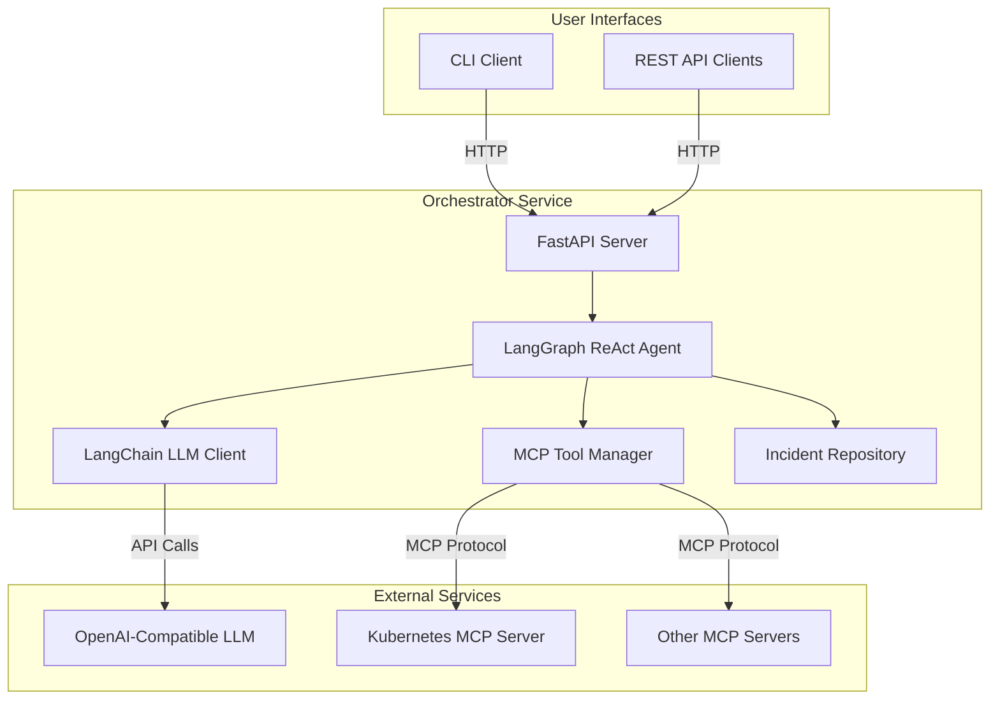
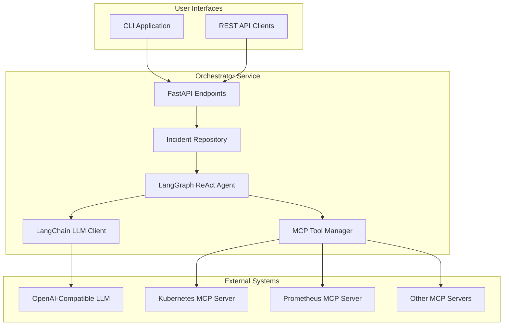
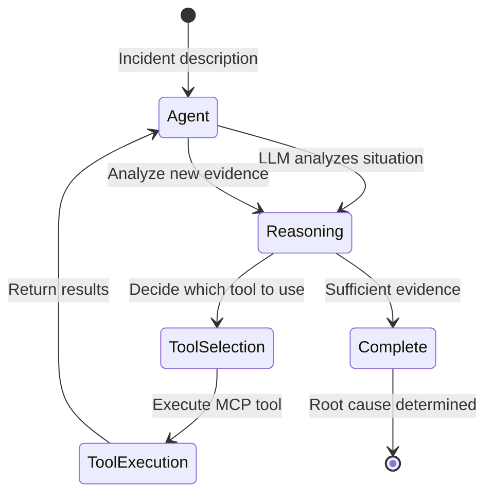
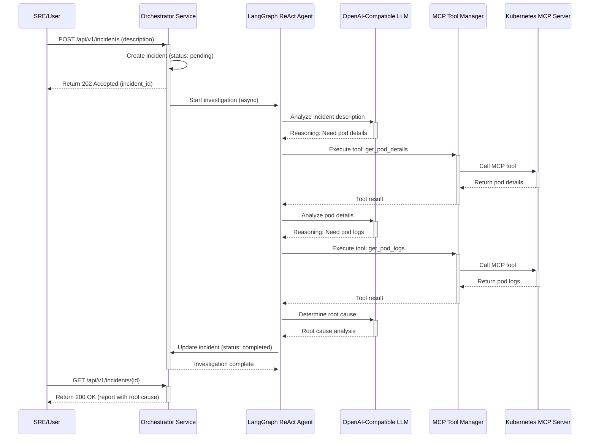

# SRE Orchestrator Architecture Document

This document outlines the overall project architecture for SRE Orchestrator, including backend systems, shared services, and non-UI specific concerns. Its primary goal is to serve as the guiding architectural blueprint for AI-driven development, ensuring consistency and adherence to chosen patterns and technologies.

**Relationship to Frontend Architecture:**
If the project includes a significant user interface, a separate Frontend Architecture Document will detail the frontend-specific design and MUST be used in conjunction with this document. Core technology stack choices documented herein (see "Tech Stack") are definitive for the entire project, including any frontend components.

## Starter Template or Existing Project

Based on the PRD, this project will be built using Python with FastAPI and LangGraph. No specific starter template or existing codebase was mentioned. The architecture will be designed from scratch, and manual setup will be required for all tooling and configuration.

## Change Log

| Date       | Version | Description              | Author |
|------------|---------|--------------------------|---|
| 2025-09-15 | 1.0     | Initial Draft            | Winston (Architect) |
| 2025-09-18 | 1.1     | Change from Go to Python | Winston (Architect) |

## High Level Architecture

### Technical Summary

The SRE Orchestrator will be a microservices-based system designed to automate incident response. The core components include the main Orchestrator service, a Kubernetes Agent, and future specialized agents, all communicating via internal REST APIs. The primary technology stack will be Python with FastAPI and LangGraph, containerized with Docker, and deployed on Kubernetes using Helm. This architecture directly supports the PRD's goal of creating a scalable and resilient system by isolating agent functionalities, enabling independent development and deployment.

### High Level Overview

The system follows a Cloud Native architecture with a single Orchestrator service that leverages LangGraph for intelligent incident investigation. All code is managed in a **Monorepo** to simplify dependency management and maintain consistency. The primary data flow begins with an SRE triggering an investigation via a REST API call to the Orchestrator. The Orchestrator uses a LangGraph ReAct agent powered by LangChain to autonomously investigate incidents. The agent uses MCP (Model Context Protocol) tools to gather data from external systems like Kubernetes clusters. The LLM-powered agent reasons about the evidence, determines which tools to use, and generates root cause suggestions with supporting evidence.

### High Level Project Diagram



### Architectural and Design Patterns

- **Architectural Style:** **Microservices**. This is mandated by the PRD to ensure scalability and resilience. Each agent will be a separate service.
- **Communication Pattern:** **Synchronous REST APIs** for internal service-to-service communication.
    - *Rationale:* For the initial implementation, direct REST calls are simple, well-understood, and sufficient for the request/response nature of the core workflows. Asynchronous patterns like Message Queues (e.g., RabbitMQ, SQS) could be introduced later if complex, long-running, or decoupled workflows are required.
- **Code Organization:** **Dependency Injection (DI)**.
    - *Rationale:* FastAPI has excellent built-in support for DI. This pattern will make the code more modular, testable, and maintainable by decoupling components from their concrete dependencies. It allows for easily swapping implementations, which is ideal for an agent-based system where different data sources or tools might be used in the future.
- **Data Storage (Incidents):** **In-Memory Storage (for MVP)**.
    - *Rationale:* The PRD for Epic 1 specifies an in-memory data store. This is sufficient for the initial development phase. This will be replaced by a persistent database in a future iteration. A **Repository Pattern** will be used to abstract the data access logic, making it easy to switch from the in-memory store to a database without changing the business logic.

## Tech Stack

### Cloud Infrastructure

- **Provider:** Cloud-Agnostic (initially). The system is designed to run on any standard Kubernetes cluster.
- **Key Services:** Kubernetes (for orchestration), Docker (for containerization), Cloud-based LLM (Provider TBD).
- **Deployment Regions:** TBD based on final cloud provider selection and user location.

### Technology Stack Table

| Category | Technology | Version | Purpose | Rationale |
| :--- | :--- | :--- | :--- | :--- |
| **Language** | Python | 3.12.11 | Primary development language | Modern, robust, with excellent support for AI/ML and web frameworks. |
| **Framework (API)** | FastAPI | 0.116.1 | High-performance web framework for building REST APIs | Offers modern Python features, automatic docs, and dependency injection. |
| **Framework (Agent)**| LangGraph | 0.2.66 | Framework for building stateful, multi-actor agent applications | Provides ReAct agent pattern for autonomous investigation workflows. |
| **LLM Framework** | LangChain | 0.3.18 | Framework for LLM application development | Unified interface for multiple LLM providers with structured output support. |
| **MCP Integration** | langchain-mcp-adapters | 0.1.2 | MCP tool integration for LangChain | Enables dynamic tool discovery and execution from MCP servers. |
| **Dependency Mgt** | Poetry | 2.2.2 | Dependency management and packaging | Simplifies dependency resolution and ensures reproducible builds. |
| **Containerization**| Docker | 28.4.0 | Container runtime and tooling | Standard for containerizing applications for consistent deployment. |
| **Orchestration** | Kubernetes | 1.34.1 | Container orchestration platform | Industry standard for deploying and managing containerized applications at scale. |
| **Deployment** | Helm | 3.19.0 | Package manager for Kubernetes | Simplifies the deployment and management of applications on Kubernetes. |
| **LLM Provider** | OpenAI-Compatible | Various | For natural language understanding and generation | Supports OpenAI, Gemini (via OpenAI proxy), and local LLMs. |
| **Data Storage (MVP)| In-Memory Dict | N/A | Temporary storage for incident data | Simple, no-dependency solution for the MVP, to be replaced later. |
| **Knowledge Graph**| YAML File | N/A | Static representation of system topology | Simple, human-readable format for the initial knowledge graph implementation. |

## Data Models

### Incident

**Purpose:** Represents a single investigation from initiation to completion. It is the central data object for the system.

**Key Attributes:**
- `id`: `string` (UUID) - Unique identifier for the incident.
- `description`: `string` - The initial problem description by the user.
- `status`: `string` - The current state of the investigation (e.g., `pending`, `investigating`, `completed`, `failed`).
- `created_at`: `datetime` - Timestamp of when the incident was created.
- `completed_at`: `datetime` - Timestamp of when the investigation was completed.
- `evidence`: `dict` - A dictionary to store all collected evidence from MCP tools.
- `extracted_entities`: `dict` - Key entities extracted from the description by the LLM (e.g., pod name, namespace).
- `suggested_root_cause`: `string` - The final conclusion from the LangGraph agent.
- `confidence_score`: `string` - The confidence level of the suggested root cause (e.g., `high`, `medium`, `low`).
- `investigation_steps`: `list` - A list of investigation steps performed by the agent.
- `error_message`: `string` - Error message if the investigation failed.

**Relationships:**
- This is the root model and does not have explicit relationships to other models in the MVP.

## Components

### Orchestrator Service

**Responsibility:** The central service that manages incident investigations using a LangGraph ReAct agent. It exposes the public-facing REST API and coordinates autonomous investigation workflows.

**Key Interfaces:**
- **Public REST API:**
    - `POST /api/v1/incidents`: Creates a new incident investigation.
    - `GET /api/v1/incidents/{id}`: Retrieves the status and results of an investigation.
    - `GET /health`: Health check endpoint with MCP tool status.
- **External API (Client):**
    - Calls OpenAI-compatible LLM API for agent reasoning.
    - Connects to MCP servers for tool execution.

**Dependencies:**
- **OpenAI-Compatible LLM:** For agent reasoning and decision-making.
- **MCP Servers:** For data collection tools (Kubernetes, Prometheus, etc.).
- **Knowledge Graph (YAML file):** For contextual information about the system.

**Technology Stack:**
- Python 3.12.11
- FastAPI 0.116.1
- LangGraph 0.2.66
- LangChain 0.3.18
- langchain-mcp-adapters 0.1.2
- Poetry 2.2.2

### CLI Application

**Responsibility:** Provides an interactive command-line interface for SREs to investigate incidents using natural language.

**Key Interfaces:**
- **Commands:**
    - `chat`: Interactive REPL-style interface
    - `investigate`: One-shot investigation
    - `list`: List recent incidents
    - `show`: View incident details
    - `config`: Manage configuration

**Dependencies:**
- **Orchestrator Service:** Communicates via REST API

**Technology Stack:**
- Python 3.12.11
- Click/Typer for CLI framework
- Rich for terminal formatting
- Poetry 2.2.2

### Component Diagram



## External APIs

### OpenAI-Compatible LLM API

- **Purpose:** Powers the LangGraph ReAct agent for reasoning, decision-making, and root cause analysis.
- **Documentation:** OpenAI API format (compatible with OpenAI, Gemini via OpenAI proxy, local LLMs)
- **Base URL:** Configured via `LLM_BASE_URL` environment variable
- **Authentication:** API Key-based via `LLM_API_KEY` environment variable. Secrets managed via Kubernetes secrets.
- **Rate Limits:** Provider-dependent. Retry logic with exponential backoff implemented.

**Key Endpoints Used:**
- `POST /v1/chat/completions`: Used for all agent reasoning and tool selection decisions.

**Integration Notes:**
- LangChain's `init_chat_model` provides unified interface across providers
- Structured output support for entity extraction
- Retry logic handles transient failures
- All LLM calls are logged with timing and token usage

### MCP Servers

- **Purpose:** Provide tools for data collection from external systems (Kubernetes, Prometheus, etc.)
- **Protocol:** Model Context Protocol (MCP)
- **Transports:**
  - `stdio`: For local MCP servers running as subprocesses
  - `streamable_http`: For remote MCP servers via HTTP
- **Configuration:** Defined in `mcp_config.yaml`

**Integration Notes:**
- `langchain-mcp-adapters` library handles MCP protocol
- Tools are automatically discovered and converted to LangChain format
- Multiple MCP servers can be connected simultaneously
- Tool execution errors are handled gracefully by the agent

## Core Workflows

### LangGraph ReAct Agent Workflow

The system uses LangGraph's ReAct (Reasoning + Acting) agent pattern for autonomous incident investigation. The agent combines reasoning about the problem with taking actions via MCP tools.

**ReAct Agent Pattern:**



**Key Components:**

1. **System Prompt**: Guides the agent to act as an SRE expert, explaining the investigation process and available tools.

2. **LLM Reasoning**: The agent uses the LLM to:
   - Analyze the incident description
   - Determine what information is needed
   - Decide which tools to invoke
   - Interpret tool results
   - Determine root cause with confidence level

3. **MCP Tool Execution**: The agent autonomously invokes tools from connected MCP servers:
   - Kubernetes tools (pod details, logs, events)
   - Prometheus tools (metrics, alerts)
   - Custom tools (application-specific diagnostics)

4. **Investigation Loop**: The agent continues gathering evidence until it has sufficient information to determine the root cause.

**Advantages:**
- **Autonomous**: Agent decides investigation strategy
- **Flexible**: Adapts to different incident types
- **Extensible**: New tools automatically available
- **Transparent**: All reasoning steps are logged

### Incident Investigation Flow



## REST API Spec

```yaml
openapi: 3.0.0
info:
  title: SRE Orchestrator API
  version: 1.0.0
  description: API for the SRE Orchestrator to manage incident investigations.
servers:
  - url: /api/v1
    description: API v1

paths:
  /incidents:
    post:
      summary: Create a new incident investigation
      operationId: createIncident
      requestBody:
        required: true
        content:
          application/json:
            schema:
              $ref: '#/components/schemas/NewIncidentRequest'
      responses:
        '202':
          description: Accepted
          content:
            application/json:
              schema:
                $ref: '#/components/schemas/NewIncidentResponse'
        '400':
          description: Bad Request
          content:
            application/json:
              schema:
                $ref: '#/components/schemas/Error'

  /incidents/{id}:
    get:
      summary: Get the status of an incident investigation
      operationId: getIncident
      parameters:
        - name: id
          in: path
          required: true
          schema:
            type: string
            format: uuid
      responses:
        '200':
          description: OK
          content:
            application/json:
              schema:
                $ref: '#/components/schemas/Incident'
        '404':
          description: Not Found
          content:
            application/json:
              schema:
                $ref: '#/components/schemas/Error'

  /health:
    get:
      summary: Health check
      operationId: getHealth
      responses:
        '200':
          description: OK
          content:
            application/json:
              schema:
                type: object
                properties:
                  status:
                    type: string
                    example: ok

components:
  schemas:
    NewIncidentRequest:
      type: object
      properties:
        description:
          type: string
          example: "Pod 'auth-service-xyz' is in CrashLoopBackOff"
      required:
        - description

    NewIncidentResponse:
      type: object
      properties:
        incident_id:
          type: string
          format: uuid
          example: "123e4567-e89b-12d3-a456-426614174000"
      required:
        - incident_id

    Incident:
      type: object
      properties:
        id:
          type: string
          format: uuid
        description:
          type: string
        status:
          type: string
          enum: [pending, running, completed, failed]
        created_at:
          type: string
          format: date-time
        completed_at:
          type: string
          format: date-time
        evidence:
          type: object
        extracted_entities:
          type: object
        suggested_root_cause:
          type: string
        confidence_score:
          type: string
          enum: [high, medium, low]
      required:
        - id
        - description
        - status
        - created_at

    Error:
      type: object
      properties:
        code:
          type: integer
        message:
          type: string
      required:
        - code
        - message
```

## Database Schema

For the MVP, incident data will be stored in an in-memory dictionary to minimize external dependencies. The structure of the `Incident` object is defined by the following JSON Schema. This schema will be used for validation and will guide the future migration to a persistent NoSQL database (e.g., MongoDB, DynamoDB).

```json
{
  "$schema": "http://json-schema.org/draft-07/schema#",
  "title": "Incident",
  "description": "Schema for an incident investigation object.",
  "type": "object",
  "properties": {
    "id": {
      "type": "string",
      "format": "uuid",
      "description": "Unique identifier for the incident."
    },
    "description": {
      "type": "string",
      "description": "The initial problem description provided by the user."
    },
    "status": {
      "type": "string",
      "enum": ["pending", "running", "completed", "failed"],
      "description": "The current state of the investigation."
    },
    "created_at": {
      "type": "string",
      "format": "date-time",
      "description": "Timestamp of when the incident was created."
    },
    "completed_at": {
      "type": "string",
      "format": "date-time",
      "description": "Timestamp of when the investigation was completed."
    },
    "evidence": {
      "type": "object",
      "description": "A dictionary to store all collected evidence.",
      "properties": {
        "pod_details": {
          "type": "object"
        },
        "pod_logs": {
          "type": "string"
        }
      }
    },
    "extracted_entities": {
      "type": "object",
      "description": "Key entities extracted from the description by the LLM.",
      "properties": {
        "pod_name": {
          "type": "string"
        },
        "namespace": {
          "type": "string"
        }
      }
    },
    "suggested_root_cause": {
      "type": "string",
      "description": "The final conclusion from the correlation engine."
    },
    "confidence_score": {
      "type": "string",
      "enum": ["high", "medium", "low"],
      "description": "The confidence level of the suggested root cause."
    }
  },
  "required": [
    "id",
    "description",
    "status",
    "created_at"
  ]
}
```

## Source Tree

```plaintext
sre-orchestrator/
├── .gitignore
├── README.md
├── poetry.lock
├── pyproject.toml          # Monorepo-level dependencies and workspace config
├── services/
│   └── orchestrator/
│       ├── src/
│       │   ├── app/
│       │   │   ├── __init__.py
│       │   │   ├── api/          # FastAPI routers and endpoints
│       │   │   │   ├── __init__.py
│       │   │   │   └── v1/
│       │   │   ├── core/         # LangGraph agent, incident repository
│       │   │   ├── models/       # Pydantic data models
│       │   │   ├── services/     # LangChain LLM client, MCP tool manager
│       │   │   └── main.py       # FastAPI application entrypoint
│       │   └── tests/
│       │       ├── unit/
│       │       └── integration/
│       ├── Dockerfile
│       ├── mcp_config.yaml       # MCP server configuration
│       └── pyproject.toml        # Service-specific dependencies
│
├── cli/
│   ├── src/
│   │   └── sre_orchestrator_cli/
│   │       ├── __init__.py
│   │       ├── main.py           # CLI entry point
│   │       ├── client.py         # Orchestrator API client
│   │       ├── ui.py             # Terminal UI and formatting
│   │       └── session.py        # Session management
│   ├── README.md
│   └── pyproject.toml            # CLI package dependencies
│
├── charts/
│   └── sre-orchestrator/         # Helm chart for the application
│       ├── Chart.yaml
│       ├── values.yaml
│       └── templates/
│           ├── _helpers.tpl
│           ├── deployment-orchestrator.yaml
│           ├── service-orchestrator.yaml
│           ├── secret-llm.yaml
│           └── configmap-mcp.yaml
│
├── docs/
│   ├── architecture.md
│   ├── langgraph-workflow.md
│   ├── mcp-integration.md
│   └── cli-guide.md
│
└── knowledge_graph.yaml          # Static knowledge graph for the MVP
```

## Infrastructure and Deployment

### Infrastructure as Code

- **Tool:** Helm 3.19.0
- **Location:** `charts/sre-orchestrator`
- **Approach:** A single Helm chart manages the deployment of the Orchestrator service. MCP servers are deployed separately and configured via the `mcp_config.yaml` file.

### Deployment Strategy

- **Strategy:** Rolling Update. This is the default Kubernetes deployment strategy and is a good starting point. It ensures zero-downtime deployments by incrementally updating pods with the new version.
- **CI/CD Platform:** TBD (e.g., GitHub Actions, GitLab CI, Jenkins). This will be decided based on the project's hosting and team preferences.
- **Pipeline Configuration:** TBD (will be located in the repository root, e.g., `.github/workflows/` or `.gitlab-ci.yml`).

### Environments

- **`development`:** Local developer environment, likely running on Minikube or Docker Desktop.
- **`staging`:** A shared, production-like environment for integration testing and QA.
- **`production`:** The live environment for end-users.

### Environment Promotion Flow

A simple, linear promotion flow will be used:
`development` -> `staging` -> `production`

Code will be merged to a `main` branch, which will trigger a deployment to `staging`. Production deployments will be triggered manually by creating a git tag.

### Rollback Strategy

- **Primary Method:** `helm rollback`. Helm's built-in rollback capabilities will be used to revert to a previous stable release in case of a failed deployment.
- **Trigger Conditions:** Failed health checks after deployment, significant increase in error rates, or manual trigger by an SRE.
- **Recovery Time Objective:** < 15 minutes.

## Error Handling Strategy

### General Approach

- **Error Model:** We will use a standardized JSON error response for all API errors. FastAPI's exception handling middleware will be used to catch exceptions and format these responses.
- **Exception Hierarchy:** A custom exception hierarchy will be created (e.g., `OrchestratorException`, `AgentException`) to represent different error conditions in the business logic.
- **Error Propagation:** Errors from downstream services (like the Kubernetes Agent or the LLM) will be caught and wrapped in custom exceptions to provide a consistent error handling model within the Orchestrator.

### Logging Standards

- **Library:** Python's built-in `logging` module, configured to output structured JSON logs.
- **Format:** JSON. Each log entry will be a JSON object containing a timestamp, log level, message, and contextual information.
- **Levels:** Standard levels will be used: `DEBUG`, `INFO`, `WARNING`, `ERROR`, `CRITICAL`.
- **Required Context:**
    - **Correlation ID:** A unique `correlation_id` will be generated for each incoming request and passed to all downstream services. This ID will be included in all log messages, allowing us to trace a request as it flows through the system.
    - **Service Context:** `service_name` (e.g., "orchestrator", "k8s-agent").
    - **User Context:** No user-specific context will be logged to avoid leaking PII.

### Error Handling Patterns

#### External API Errors
- **Retry Policy:** A simple exponential backoff retry mechanism will be implemented for transient errors when calling the LLM and Kubernetes APIs.
- **Circuit Breaker:** Not planned for the MVP, but can be added later if service instability becomes an issue.
- **Timeout Configuration:** All external API calls will have a reasonable timeout (e.g., 15-30 seconds) to prevent the system from hanging.
- **Error Translation:** Errors from external APIs will be translated into internal application exceptions.

#### Business Logic Errors
- **Custom Exceptions:** Specific exceptions will be created for business logic failures (e.g., `IncidentNotFoundException`, `InvalidDescriptionException`).
- **User-Facing Errors:** API responses will use standard HTTP status codes (4xx for client errors, 5xx for server errors) with a consistent JSON error body.
- **Error Codes:** Not planned for the MVP. Error messages will be descriptive.

#### Data Consistency
- **Transaction Strategy:** Not applicable for the in-memory data store. When a persistent database is added, transactions will be used to ensure atomic operations.
- **Compensation Logic:** Not applicable for the MVP's simple workflows.
- **Idempotency:** The `POST /api/v1/incidents` endpoint will not be idempotent in the MVP.

## Coding Standards

### Core Standards

- **Languages & Runtimes:** Python 3.12.4
- **Style & Linting:** We will use `ruff` for linting and `black` for code formatting. A `pyproject.toml` file will contain the configurations for these tools to ensure consistency.
- **Test Organization:** Test files will be located in the `tests/` directory of each service. Test filenames will be prefixed with `test_`.

### Naming Conventions

We will follow the standard Python PEP 8 naming conventions. No project-specific deviations are necessary at this time.

| Element | Convention | Example |
| :--- | :--- | :--- |
| Variable | `snake_case` | `incident_id` |
| Function | `snake_case` | `create_incident` |
| Class | `PascalCase` | `IncidentModel` |
| Module | `snake_case` | `correlation_engine.py` |

### Critical Rules

- **Rule 1:** All API endpoints must use FastAPI's dependency injection system to acquire dependencies (like service clients). Do not instantiate clients directly in endpoint functions.
- **Rule 2:** All public functions and methods must have a docstring explaining their purpose, arguments, and return values.
- **Rule 3:** All business logic must be covered by unit tests with a target of 80% code coverage.
- **Rule 4:** Never log sensitive information, such as API keys or secrets.

### Language-Specific Guidelines

- **Python Specifics:**
    - Use Pydantic models for all data validation and serialization in the API layer.
    - Use type hints for all function signatures.

## Test Strategy and Standards

### Testing Philosophy

- **Approach:** Test-After. While Test-Driven Development (TDD) is valuable, a test-after approach is more pragmatic for the initial rapid prototyping and development phase of this project.
- **Coverage Goals:** A project-wide target of 80% line coverage is required. This will be enforced in the CI pipeline.
- **Test Pyramid:** We will follow a standard test pyramid approach, with a large base of fast unit tests, a smaller layer of integration tests, and a minimal set of end-to-end tests for critical user journeys.

### Test Types and Organization

#### Unit Tests
- **Framework:** `pytest`
- **File Convention:** `test_*.py` inside the `tests/` directory of each service.
- **Location:** `services/*/tests/unit/`
- **Mocking Library:** `unittest.mock`
- **Coverage Requirement:** 80%

**AI Agent Requirements:**
- Generate tests for all public methods.
- Cover edge cases and error conditions.
- Follow AAA pattern (Arrange, Act, Assert).
- Mock all external dependencies (e.g., other services, databases, external APIs).

#### Integration Tests
- **Scope:** Testing the interaction between the Orchestrator service and the Kubernetes Agent, and between the services and external APIs (like the Kubernetes API).
- **Location:** `services/*/tests/integration/`
- **Test Infrastructure:**
    - **Kubernetes:** A real Kubernetes cluster (e.g., `kind` or `k3s`) will be used for integration tests in the CI pipeline.
    - **External APIs:** `pytest-httpserver` or a similar library will be used to mock the LLM API.

#### End-to-End Tests
- **Framework:** `pytest` with `requests` library.
- **Scope:** Testing the full user journey from creating an incident via the public REST API to retrieving the final report.
- **Environment:** These tests will run against the `staging` environment.
- **Test Data:** Pre-defined incident descriptions will be used to trigger different investigation scenarios.

### Test Data Management

- **Strategy:** Test data will be managed within the test files themselves for simplicity.
- **Fixtures:** `pytest` fixtures will be used to create reusable test data and resources.
- **Factories:** Not planned for the MVP.
- **Cleanup:** The test environment (e.g., the `kind` cluster) will be created and destroyed for each CI run to ensure a clean state.

### Continuous Testing

- **CI Integration:** The CI pipeline will run all unit and integration tests on every commit to the `main` branch.
- **Performance Tests:** Not planned for the MVP.
- **Security Tests:** A static analysis security testing (SAST) tool like `bandit` will be integrated into the CI pipeline.

## Security

### Input Validation

- **Validation Library:** Pydantic (as part of FastAPI).
- **Validation Location:** All incoming API requests will be validated at the edge of the service by FastAPI using Pydantic models.
- **Required Rules:**
    - All external inputs MUST be validated.
    - Validation at API boundary before processing.
    - Whitelist approach preferred over blacklist.

### Authentication & Authorization

- **Auth Method:** No authentication will be implemented for the public API in the MVP. For future iterations, API Key authentication is recommended.
- **Session Management:** Not applicable.
- **Required Patterns:**
    - The Kubernetes Agent will use a Kubernetes Service Account with a read-only Role to authenticate with the Kubernetes API. This follows the principle of least privilege.

### Secrets Management

- **Development:** Secrets (e.g., LLM API key) will be managed via environment variables, loaded from a `.env` file which will be excluded from git.
- **Production:** Secrets will be managed using Kubernetes Secrets.
- **Code Requirements:**
    - NEVER hardcode secrets.
    - Access via environment variables or Kubernetes Secrets only.
    - No secrets in logs or error messages.

### API Security

- **Rate Limiting:** Not planned for the MVP, but a library like `slowapi` can be added later if needed.
- **CORS Policy:** A permissive CORS policy will be used for development, but it should be restricted to known origins in production.
- **Security Headers:** Standard security headers (e.g., `X-Content-Type-Options`, `X-Frame-Options`) will be added to all API responses using middleware.
- **HTTPS Enforcement:** HTTPS will be enforced at the ingress level in the Kubernetes cluster.

### Data Protection

- **Encryption at Rest:** Not applicable for the in-memory store. When a persistent database is added, it must be configured to encrypt data at rest.
- **Encryption in Transit:** All communication between services and with external APIs (LLM, Kubernetes) will use TLS.
- **PII Handling:** The system is not designed to handle Personally Identifiable Information (PII). Incident descriptions should be sanitized of any PII before being submitted.
- **Logging Restrictions:** Do not log raw incident descriptions or any data that might contain sensitive information.

### Dependency Security

- **Scanning Tool:** `pip-audit` or a similar tool will be integrated into the CI pipeline to scan for known vulnerabilities in Python dependencies.
- **Update Policy:** Dependencies will be reviewed and updated on a regular basis.
- **Approval Process:** New dependencies must be approved by the team before being added to the project.

### Security Testing

- **SAST Tool:** `bandit` will be integrated into the CI pipeline to perform static analysis security testing.
- **DAST Tool:** Not planned for the MVP.
- **Penetration Testing:** Not planned for the MVP.

## Checklist Results Report

### Executive Summary
- **Overall Architecture Readiness:** High
- **Critical Risks Identified:** None. The main dependency is on the selection of a final LLM provider, which is a known TBD.
- **Key Strengths:** The architecture is a straightforward, modern implementation of a microservices pattern that directly aligns with the PRD. It is well-documented and provides a solid foundation for the MVP.
- **Project Type:** Backend service. All frontend-specific sections of the checklist were skipped.

### Section Analysis
| Section | Pass Rate | Comment |
| :--- | :--- | :--- |
| 1. Requirements Alignment | 95% | Strong alignment with the PRD. Minor gap in detailed performance scenario planning, which is acceptable for the MVP. |
| 2. Architecture Fundamentals | 100% | The architecture is clear, modular, and follows best practices. |
| 3. Technical Stack & Decisions | 95% | The tech stack is well-defined. Minor gap in documenting alternative technology choices. |
| 4. Frontend Design | N/A | Skipped. |
| 5. Resilience & Operations | 100% | The strategy for error handling, monitoring, and deployment is well-defined for an MVP. |
| 6. Security & Compliance | 100% | A comprehensive, layered security approach is defined. |
| 7. Implementation Guidance | 100% | The coding standards, testing strategy, and source tree provide clear guidance for developers. |
| 8. Dependency Management | 100% | The approach to managing dependencies is clear. |
| 9. AI Agent Suitability | 100% | The architecture's clarity and modularity make it highly suitable for AI-driven development. |
| 10. Accessibility | N/A | Skipped. |