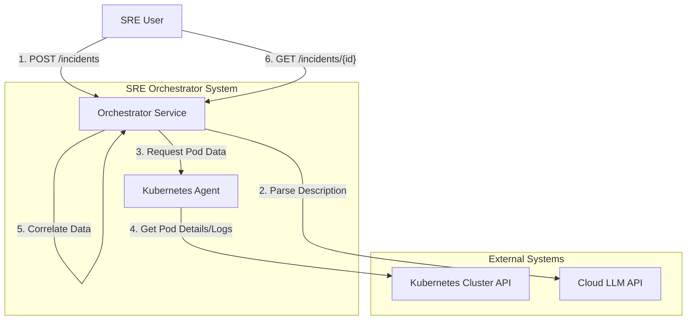
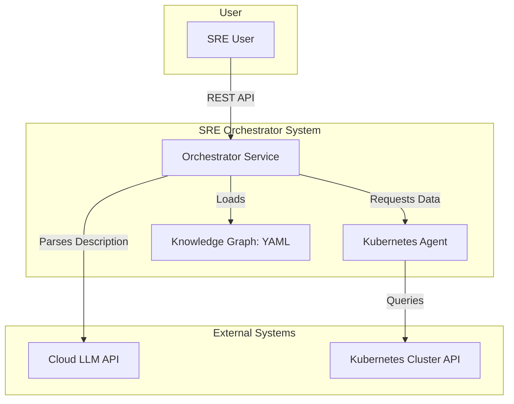
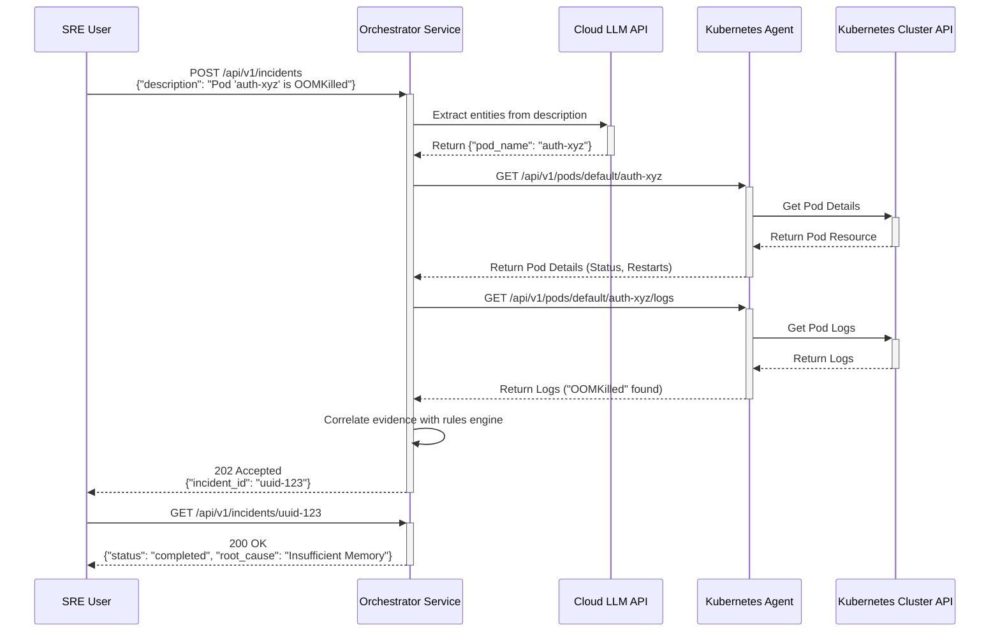

# SRE Orchestrator Architecture Document

## Introduction

This document outlines the overall project architecture for SRE Orchestrator, including backend systems, shared services, and non-UI specific concerns. Its primary goal is to serve as the guiding architectural blueprint for AI-driven development, ensuring consistency and adherence to chosen patterns and technologies.

**Relationship to Frontend Architecture:**
If the project includes a significant user interface, a separate Frontend Architecture Document will detail the frontend-specific design and MUST be used in conjunction with this document. Core technology stack choices documented herein (see "Tech Stack") are definitive for the entire project, including any frontend components.

---

### Starter Template or Existing Project

The PRD does not mention a specific starter template or existing project. The plan is to initialize a new Go project with a standard layout (`/cmd`, `/internal`, `/pkg`), indicating a "from-scratch" approach. This provides maximum flexibility but requires manual setup for all tooling and configuration.

---

### High Level Architecture

This section establishes the foundational architecture for the SRE Orchestrator, based on the goals and technical assumptions outlined in the PRD.

#### Technical Summary

The SRE Orchestrator will be implemented using a **microservices architecture** style, with the primary language being **Go**. The system is composed of a central **Orchestrator** service and specialized **Agents**, starting with a **Kubernetes Agent**. Communication is handled via **REST APIs**. This design directly supports the PRD's goals of creating a scalable and resilient system for automated incident triage, allowing for independent development and deployment of diagnostic capabilities.

#### High Level Overview

1.  **Architectural Style:** The system follows a **Microservices** architecture. The Orchestrator and each diagnostic agent (e.g., Kubernetes Agent) are independent services, promoting scalability and separation of concerns as stated in the PRD.
2.  **Repository Structure:** A **Monorepo** will be used to house the code for all services, simplifying dependency management and ensuring code consistency.
3.  **Primary Data Flow:**
    *   An SRE initiates an investigation via a `POST` request to the Orchestrator's REST API.
    *   The Orchestrator uses an external LLM to parse the request and identify key entities (e.g., pod name).
    *   It then dispatches a task to the Kubernetes Agent.
    *   The Kubernetes Agent queries the Kubernetes API for pod status, logs, and configuration.
    *   The agent returns this evidence to the Orchestrator.
    *   The Orchestrator uses a rules engine and a static knowledge graph to analyze the evidence and suggest a root cause.
    *   The final report is stored, and the SRE can retrieve it via a `GET` request to the API.
4.  **Key Architectural Decisions:**
    *   **Go Language:** Chosen for its high performance, strong concurrency model, and excellent native support for the Kubernetes ecosystem.
    *   **Microservices:** Selected to allow for independent scaling, deployment, and failure of components, which is critical for a reliability-focused tool.
    *   **Monorepo:** Adopted to streamline development and dependency management in the project's early stages.

#### High Level Project Diagram



#### Architectural and Design Patterns

*   **Microservices Architecture:** This is the foundational pattern, as specified in the PRD. It involves breaking the application into a collection of loosely coupled, independently deployable services.
    *   *Rationale:* Enables scalability, fault isolation, and technology diversity for different agents in the future.
*   **REST API for Communication:** External communication with the system will be via a RESTful API. For internal communication between the Orchestrator and its agents, we will also use REST/HTTP.
    *   *Rationale:* REST is a well-understood, simple, and ubiquitous standard. While gRPC could offer performance benefits, REST is sufficient for the MVP and simplifies development and debugging.
*   **Repository Pattern for Data Access:** Data access within the Orchestrator (for incidents) and agents will be abstracted behind a repository interface.
    *   *Rationale:* This decouples the business logic from the data storage implementation. It allows us to start with the PRD-specified in-memory store and easily swap it for a persistent database in the future without significant refactoring.

---

### Tech Stack

This section provides the definitive technology selection for the SRE Orchestrator. These choices are derived from the PRD's technical assumptions and are considered the single source of truth for the project. All development must adhere to this stack.

#### Cloud Infrastructure

*   **Provider:** Cloud-Agnostic for the MVP. The application is designed to run on any Kubernetes cluster.
*   **Key Services:** The primary external dependency is a cloud-based LLM service (e.g., Google AI, OpenAI).
*   **Deployment Regions:** Not applicable for the initial, cloud-agnostic deployment.

#### Technology Stack Table

| Category | Technology | Version | Purpose | Rationale |
| :--- | :--- | :--- | :--- | :--- |
| **Language** | Go | 1.22.x | Primary development language | Strong performance, concurrency, and excellent ecosystem for cloud-native/Kubernetes tools, as specified in the PRD. |
| **Web Framework** | Gin | 1.9.x | High-performance HTTP web framework | Provides a lightweight yet powerful framework for building the REST APIs, aligning with the need for a fast and efficient service. |
| **Containerization** | Docker | 26.x | Container runtime and image format | Standard for containerizing applications, ensuring consistent environments from development to production. |
| **Deployment** | Helm | 3.15.x | Kubernetes package manager | Automates the deployment and management of the application's components on Kubernetes, as required by the PRD. |
| **CI/CD** | GitHub Actions | N/A | Continuous Integration & Deployment | Automates the build, test, and deployment pipeline directly from the source code repository. |
| **LLM Integration** | OpenAI / Google AI | N/A | Natural Language Understanding | Used for parsing incident descriptions to extract key entities. The specific SDK will be chosen during implementation. |
| **Agent Framework**| Langgraph | N/A | Agent Development | Framework for building stateful, multi-actor applications with LLMs. |
| **Knowledge Graph**| YAML File | N/A | System Topology Representation | A simple, file-based approach for the MVP to store component relationships, as specified in the PRD. |

---

### Data Models

This section defines the core data models for the SRE Orchestrator. The primary entity is the `Incident`, which represents a single investigation from creation to resolution.

#### Incident

**Purpose:** To track the state and results of a single incident investigation. It serves as the central data structure for the entire orchestration process.

**Key Attributes:**

*   `ID`: `string` - A unique identifier (UUID) generated for each incident.
*   `Description`: `string` - The original, user-provided description of the problem.
*   `Status`: `string` - The current state of the investigation (e.g., `pending`, `investigating`, `completed`, `failed`).
*   `CreatedAt`: `timestamp` - The time the incident was created.
*   `CompletedAt`: `timestamp` - The time the investigation was completed.
*   `ExtractedEntities`: `object` - Structured data extracted from the description by the LLM (e.g., `{ "pod_name": "...", "namespace": "..." }`).
*   `Evidence`: `array` - A collection of data artifacts gathered by agents (e.g., pod status, logs, configuration details).
*   `SuggestedRootCause`: `string` - The final conclusion from the correlation engine.
*   `ConfidenceScore`: `string` - The confidence level of the suggested root cause (e.g., `high`, `medium`, `low`).

**Relationships:**

*   The `Incident` model is self-contained and has no direct relationships with other core models in the MVP. It is the root object for an investigation.

---

### Components

This section breaks down the SRE Orchestrator into its major logical components, defining their responsibilities and interactions as per the microservices architecture.

#### Orchestrator Service

*   **Responsibility:** Acts as the central brain of the system. It exposes the public REST API, manages the lifecycle of an incident, coordinates with the LLM for parsing, dispatches tasks to agents, and runs the correlation engine to determine a root cause.
*   **Key Interfaces:**
    *   **Public REST API:**
        *   `POST /api/v1/incidents`: To create a new investigation.
        *   `GET /api/v1/incidents/{id}`: To retrieve the status and results.
    *   **Internal Client:** Makes HTTP calls to the Kubernetes Agent's internal API.
*   **Dependencies:**
    *   Cloud LLM API (for parsing descriptions).
    *   Kubernetes Agent (for data collection).
    *   Knowledge Graph (for contextual information).
*   **Technology Stack:** Go, Gin framework.

#### Kubernetes Agent

*   **Responsibility:** A specialized microservice that acts as the interface to a Kubernetes cluster. It is responsible for gathering all required diagnostic data from the cluster, such as pod status, configuration, events, and logs.
*   **Key Interfaces:**
    *   **Internal REST API:**
        *   `GET /api/v1/pods/{namespace}/{name}`: To get pod details.
        *   `GET /api/v1/pods/{namespace}/{name}/logs`: To get pod logs.
*   **Dependencies:**
    *   Kubernetes Cluster API.
*   **Technology Stack:** Go, Gin framework, official Kubernetes Go client (`client-go`).

#### Component Diagram

This diagram illustrates the primary components and the flow of communication between them.



---

### External APIs

This section details the external APIs the SRE Orchestrator will integrate with. These integrations are critical for the system's core functionality.

#### Cloud LLM API

*   **Purpose:** To parse natural language incident descriptions and extract structured entities like pod names, namespaces, and the nature of the problem.
*   **Documentation:** Provider-specific (e.g., platform.openai.com, ai.google.dev). The specific provider will be determined during implementation.
*   **Base URL(s):** Provider-specific.
*   **Authentication:** API Key sent in an HTTP Authorization header.
*   **Rate Limits:** To be determined based on the selected provider and plan.

*   **Key Endpoints Used:**
    *   `POST /v1/chat/completions` (or equivalent) - To send a prompt for entity extraction.

*   **Integration Notes:** The Orchestrator will implement an adapter or client pattern to abstract the specific LLM provider's API. This will allow for swapping providers in the future with minimal code changes. All communication must be over TLS as per NFR3.

#### Kubernetes API

*   **Purpose:** To retrieve live diagnostic information from the Kubernetes cluster, including the status, configuration, events, and logs of pods.
*   **Documentation:** https://kubernetes.io/docs/reference/kubernetes-api/
*   **Base URL(s):** The in-cluster API server address (e.g., `https://kubernetes.default.svc`).
*   **Authentication:** In-cluster authentication using a Service Account token mounted into the Kubernetes Agent's pod.
*   **Rate Limits:** Not a primary concern for in-cluster communication, but subject to the API server's built-in limits.

*   **Key Endpoints Used:**
    *   `GET /api/v1/namespaces/{namespace}/pods/{name}` - To retrieve the full pod resource.
    *   `GET /api/v1/namespaces/{namespace}/pods/{name}/log` - To retrieve container logs.

*   **Integration Notes:** The Kubernetes Agent will use the official `client-go` library to interact with the API. This library handles the complexities of authentication, endpoint discovery, and request/response marshalling. The agent's Service Account will be granted read-only permissions via RBAC, as required by NFR4.

---

### Core Workflows

This section illustrates the primary workflow for an end-to-end incident investigation using a sequence diagram. This diagram shows the interactions between all the major components of the system.



---

### REST API Spec

This section provides the OpenAPI 3.0 specification for the SRE Orchestrator's public-facing REST API. This serves as the formal contract for any client interacting with the system.

```yaml
openapi: 3.0.0
info:
  title: SRE Orchestrator API
  version: "1.0.0"
  description: API for managing and monitoring automated incident investigations.
servers:
  - url: /api/v1
    description: API version 1

paths:
  /incidents:
    post:
      summary: Create a new incident investigation
      operationId: createIncident
      requestBody:
        required: true
        content:
          application/json:
            schema:
              type: object
              properties:
                description:
                  type: string
                  description: "A natural language description of the incident."
                  example: "Pod 'auth-service-xyz' in namespace 'production' is in a CrashLoopBackOff state."
              required:
                - description
      responses:
        '202':
          description: Investigation accepted.
          content:
            application/json:
              schema:
                type: object
                properties:
                  incident_id:
                    type: string
                    format: uuid
                    description: "A unique identifier for the incident."
        '400':
          description: Bad request (e.g., missing description).

  /incidents/{id}:
    get:
      summary: Get the status and results of an investigation
      operationId: getIncident
      parameters:
        - name: id
          in: path
          required: true
          description: The UUID of the incident to retrieve.
          schema:
            type: string
            format: uuid
      responses:
        '200':
          description: Successful retrieval of the incident report.
          content:
            application/json:
              schema:
                $ref: '#/components/schemas/IncidentReport'
        '404':
          description: Incident not found.

components:
  schemas:
    IncidentReport:
      type: object
      properties:
        incident_id:
          type: string
          format: uuid
        description:
          type: string
        status:
          type: string
          enum: [pending, investigating, completed, failed]
        created_at:
          type: string
          format: date-time
        completed_at:
          type: string
          format: date-time
        evidence:
          type: array
          items:
            type: object
            description: "A collection of data artifacts gathered by agents."
        suggested_root_cause:
          type: string
        confidence_score:
          type: string
          enum: [high, medium, low]
```

---

### Database Schema

For the Minimum Viable Product (MVP), the SRE Orchestrator will use a simple in-memory data store, as specified in the PRD. This avoids introducing an external database dependency in the initial phase. The following schema represents the structure of the `Incident` object as it will be stored in memory.

The data will be stored in a thread-safe map (e.g., a `map[string]Incident` protected by a `sync.RWMutex` in Go).

#### In-Memory `Incident` Structure

This is the Go struct that will represent our `Incident` record in memory.

```go
package store

import (
    "time"
)

// Status represents the state of an incident investigation.
type Status string

const (
    StatusPending       Status = "pending"
    StatusInvestigating Status = "investigating"
    StatusCompleted     Status = "completed"
    StatusFailed        Status = "failed"
)

// ConfidenceScore represents the confidence level of a root cause analysis.
type ConfidenceScore string

const (
    ConfidenceHigh   ConfidenceScore = "high"
    ConfidenceMedium ConfidenceScore = "medium"
    ConfidenceLow    ConfidenceScore = "low"
)

// Incident represents the full record of an investigation.
type Incident struct {
    ID                 string          `json:"incident_id"`
    Description        string          `json:"description"`
    Status             Status          `json:"status"`
    CreatedAt          time.Time       `json:"created_at"`
    CompletedAt        *time.Time      `json:"completed_at,omitempty"`
    ExtractedEntities  map[string]any  `json:"extracted_entities,omitempty"`
    Evidence           []any           `json:"evidence,omitempty"`
    SuggestedRootCause string          `json:"suggested_root_cause,omitempty"`
    ConfidenceScore    ConfidenceScore `json:"confidence_score,omitempty"`
}
```

**Rationale:**

*   **Simplicity:** This approach is extremely simple to implement and has no external dependencies, making it ideal for the MVP.
*   **Performance:** In-memory access is extremely fast, satisfying the NFR for API response times.
*   **Volatility:** The primary trade-off is that all incident data will be lost if the Orchestrator service restarts. This is an acceptable limitation for the MVP, as the focus is on the diagnostic workflow, not on long-term data persistence. A persistent database (e.g., PostgreSQL, Redis) can be added in a future epic by implementing a new repository that conforms to the existing data access interface.

---

### Source Tree

This section outlines the proposed folder structure for the SRE Orchestrator monorepo. The structure is designed to support a multi-service Go application, separating concerns and providing a clear organization for the different components of the system.

```plaintext
sre-orchestrator/
├── .github/
│   └── workflows/          # GitHub Actions CI/CD pipelines
│       ├── build-test.yml
│       └── release.yml
├── .gitignore
├── README.md
├── go.mod                  # Go modules file for the entire monorepo
├── go.sum
│
├── cmd/                    # Main application entrypoints
│   ├── orchestrator/       # Orchestrator Service main package
│   │   └── main.go
│   └── k8s-agent/          # Kubernetes Agent main package
│       └── main.go
│
├── internal/               # Private application and library code
│   ├── orchestrator/       # Orchestrator-specific code
│   │   ├── api/            # HTTP handlers and routing
│   │   ├── config/         # Configuration loading
│   │   ├── correlation/    # Root cause correlation engine
│   │   ├── llm/            # Client for LLM integration
│   │   ├── store/          # In-memory incident store
│   │   └── agentclient/    # Client for communicating with the K8s Agent
│   │
│   └── k8s-agent/          # Kubernetes Agent-specific code
│       ├── api/            # Internal HTTP handlers and routing
│       ├── config/         # Configuration loading
│       └── kubernetes/     # Kubernetes client and data retrieval logic
│
├── pkg/                    # Shared libraries (if any, keep minimal)
│   └── log/                # Example: a shared logging library
│
├── charts/                 # Helm charts for deployment
│   └── sre-orchestrator/   # Main chart deploying all services
│       ├── Chart.yaml
│       ├── values.yaml
│       └── templates/
│           ├── orchestrator-deployment.yaml
│           ├── k8s-agent-deployment.yaml
│           └── ...
│
└── configs/                # Static configuration files
    └── knowledge_graph.yaml # The file-based knowledge graph
```

**Rationale:**

*   **Monorepo:** A single `go.mod` file at the root manages dependencies for all services, aligning with the PRD's monorepo decision.
*   **`/cmd` Directory:** This is a standard Go project layout where each subdirectory is a runnable application. This clearly separates the entrypoints for the Orchestrator and the Kubernetes Agent.
*   **`/internal` Directory:** This is crucial for a monorepo. Code within `/internal` can only be imported by code inside the same parent directory, enforcing strict separation between the services. `orchestrator` cannot import code from `internal/k8s-agent` and vice-versa.
*   **`/pkg` Directory:** This directory is reserved for code that is safe to be shared across different services. It should be used sparingly to avoid creating tight coupling between components.
*   **`/charts` Directory:** Consolidates all Kubernetes deployment configurations into a single location, as required by the PRD.
*   **`/configs` Directory:** Provides a clear and dedicated location for runtime configuration files like the knowledge graph.

---

### Infrastructure and Deployment

This section defines the deployment architecture and practices for the SRE Orchestrator, focusing on a streamlined, automated process using the technologies selected in the Tech Stack.

#### Infrastructure as Code

*   **Tool:** Helm 3.15.x
*   **Location:** `/charts/sre-orchestrator/`
*   **Approach:** A single umbrella Helm chart will be used to manage the deployment of all system components (Orchestrator, Kubernetes Agent, etc.) as a unified application. This aligns with NFR1, which requires the entire system to be deployable via a single Helm chart. The chart will manage Deployments, Services, ServiceAccounts, and the necessary RBAC roles for the Kubernetes Agent.

#### Deployment Strategy

*   **Strategy:** A standard Kubernetes **Rolling Update** strategy will be used. This ensures zero-downtime deployments by incrementally replacing old pods with new ones.
*   **CI/CD Platform:** GitHub Actions.
*   **Pipeline Configuration:** The CI/CD pipeline will be defined in `.github/workflows/`. It will be triggered on pushes to the main branch and will consist of the following stages:
    1.  **Build:** Build the Go binaries for all services.
    2.  **Test:** Run unit and integration tests.
    3.  **Dockerize:** Build and push Docker images for each service to a container registry.
    4.  **Package & Deploy:** Package the Helm chart and deploy it to the target Kubernetes cluster.

#### Environments

For the MVP, the focus is on a single target environment.

*   **Local:** Developers will run the services locally using tools like `go run` or a local Kubernetes cluster (e.g., Kind, Minikube) for testing.
*   **Production:** A single production Kubernetes cluster where the SRE Orchestrator will be deployed.

#### Environment Promotion Flow

For the MVP, there is no formal multi-stage promotion flow. Changes merged to the `main` branch will be automatically deployed to the production environment after passing all tests.

```
[Local Development] -> [Git Push to main] -> [CI/CD Pipeline (Build, Test)] -> [Deploy to Production]
```

#### Rollback Strategy

*   **Primary Method:** `helm rollback <release-name> <revision>`
*   **Trigger Conditions:** A rollback will be triggered manually by an SRE in response to a critical failure of a new release (e.g., a spike in 5xx errors, non-functional API). Automated rollbacks based on health checks can be configured in the future.
*   **Recovery Time Objective:** A rollback using Helm can typically be completed in under 5 minutes.

---

### Error Handling Strategy

This section defines a comprehensive error handling and logging strategy. A consistent approach is critical for a reliability tool like the SRE Orchestrator to ensure it is itself debuggable and observable.

#### General Approach

*   **Error Model:** Go's standard `error` interface will be used. Custom error types will be created to wrap standard errors with additional context (e.g., operation, status code).
*   **Exception Hierarchy:** Not applicable in Go. Errors are returned as values.
*   **Error Propagation:** Errors will be wrapped with context at each layer of the application (e.g., repository, service, API handler) using `fmt.Errorf("operation failed: %w", err)`. This creates a stack of errors that can be logged with full context.

#### Logging Standards

*   **Library:** `zerolog` (a popular structured logging library for Go).
*   **Format:** JSON. Structured logs are essential for machine-readability and integration with log aggregation platforms.
*   **Levels:** `debug`, `info`, `warn`, `error`, `fatal`.
*   **Required Context:**
    *   **Correlation ID:** A unique `incident_id` will be attached to every log message related to a specific investigation. This allows for easy filtering of all logs for a single workflow.
    *   **Service Context:** Each log message will include the service name (`orchestrator` or `k8s-agent`).
    *   **User Context:** Not applicable for this backend service.

#### Error Handling Patterns

##### External API Errors (LLM, Kubernetes API)

*   **Retry Policy:** A simple, immediate retry policy (e.g., 1 retry) will be implemented for transient network errors when calling external APIs.
*   **Circuit Breaker:** Not included in the MVP, but a library like `gobreaker` could be added in the future if external API instability becomes an issue.
*   **Timeout Configuration:** All outbound HTTP requests will have a short, aggressive timeout (e.g., 15 seconds) to prevent the system from hanging on unresponsive external services.
*   **Error Translation:** Errors from external APIs will be wrapped in custom error types to provide a consistent error model within the application.

##### Business Logic Errors

*   **Custom Exceptions:** Custom error variables (e.g., `ErrIncidentNotFound`) will be defined for known business logic failures.
*   **User-Facing Errors:** API handlers will translate internal errors into appropriate HTTP status codes (`400`, `404`, `500`) and a consistent JSON error response body: `{"error": "message"}`.
*   **Error Codes:** Not needed for the MVP. HTTP status codes are sufficient.

##### Data Consistency

*   **Transaction Strategy:** Not applicable for the in-memory store. If a persistent database is added, operations will be wrapped in transactions.
*   **Compensation Logic:** Not applicable for the MVP's simple workflow.
*   **Idempotency:** The incident creation endpoint is not idempotent by design. All other `GET` endpoints are naturally idempotent.
