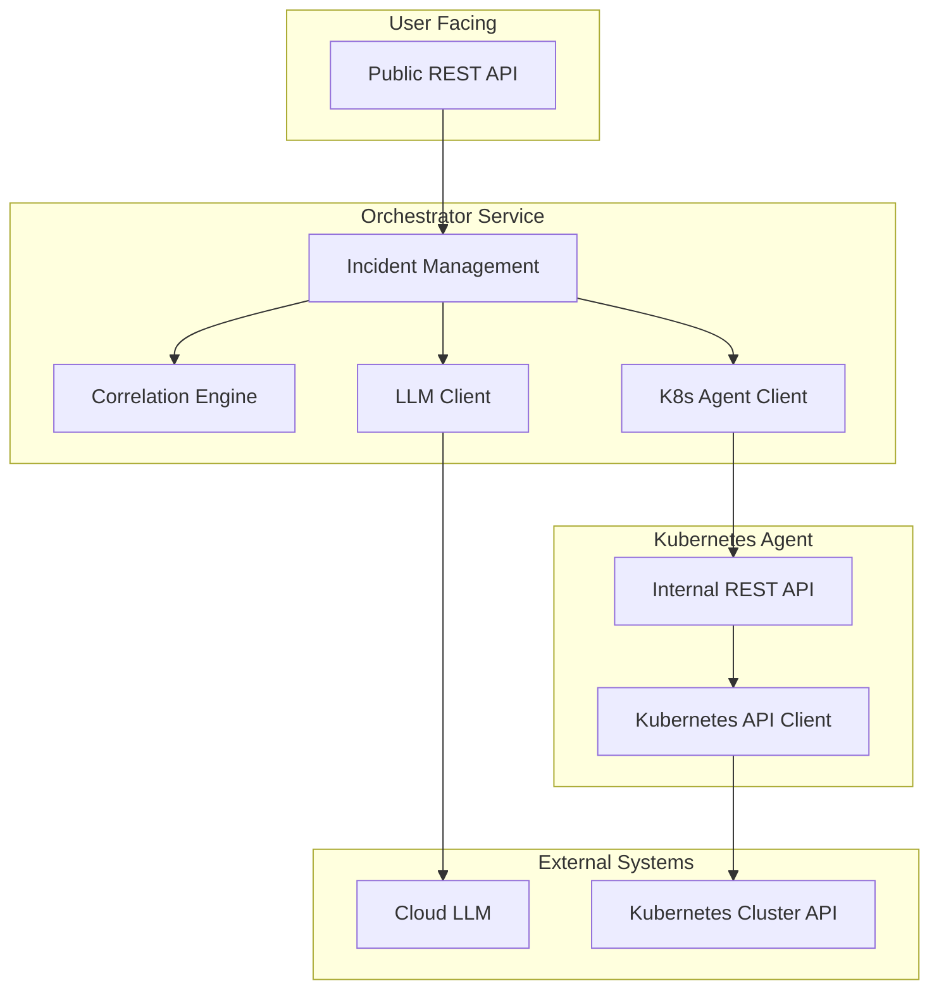

# Components

### Orchestrator Service

**Responsibility:** The central brain of the system. It manages the lifecycle of an incident investigation, coordinates with other agents, and exposes the public-facing REST API.

**Key Interfaces:**
- **Public REST API:**
    - `POST /api/v1/incidents`: Creates a new incident investigation.
    - `GET /api/v1/incidents/{id}`: Retrieves the status and results of an investigation.
- **Internal REST API (Client):**
    - Calls the Kubernetes Agent's API to request pod data.
- **External API (Client):**
    - Calls the Cloud LLM's API to parse incident descriptions.

**Dependencies:**
- **Kubernetes Agent:** For retrieving data from the Kubernetes cluster.
- **Cloud LLM:** For natural language processing.
- **Knowledge Graph (YAML file):** For contextual information about the system.

**Technology Stack:**
- Python 3.12.4
- FastAPI 0.111.0
- LangGraph 0.0.53
- Poetry 1.8.2

### Kubernetes Agent

**Responsibility:** A specialized agent responsible for all interactions with the Kubernetes API. It retrieves pod status, logs, and configuration details on behalf of the Orchestrator.

**Key Interfaces:**
- **Internal REST API:**
    - `GET /api/v1/pods/{namespace}/{name}`: Retrieves pod details.
    - `GET /api/v1/pods/{namespace}/{name}/logs`: Retrieves pod logs.
    - `GET /health`: Health check endpoint.

**Dependencies:**
- **Kubernetes API:** The agent's sole purpose is to interact with this API.

**Technology Stack:**
- Python 3.12.4
- FastAPI 0.111.0
- `kubernetes` Python client library
- Poetry 1.8.2

### Component Diagram

