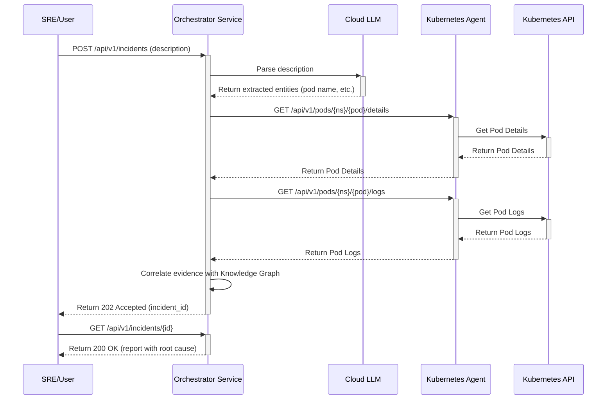

# Core Workflows

### Incident Investigation Flow

```mermaid
sequenceDiagram
    participant SRE as SRE/User
    participant Orch as Orchestrator Service
    participant LLM as Cloud LLM
    participant K8sA as Kubernetes Agent
    participant K8s as Kubernetes API

    SRE->>+Orch: POST /api/v1/incidents (description)
    Orch->>+LLM: Parse description
    LLM-->>-Orch: Return extracted entities (pod name, etc.)
    Orch->>+K8sA: GET /api/v1/pods/{ns}/{pod}/details
    K8sA->>+K8s: Get Pod Details
    K8s-->>-K8sA: Return Pod Details
    K8sA-->>-Orch: Return Pod Details
    Orch->>+K8sA: GET /api/v1/pods/{ns}/{pod}/logs
    K8sA->>+K8s: Get Pod Logs
    K8s-->>-K8sA: Return Pod Logs
    K8sA-->>-Orch: Return Pod Logs
    Orch->>Orch: Correlate evidence with Knowledge Graph
    Orch-->>-SRE: Return 202 Accepted (incident_id)

    %% Some time later %%

    SRE->>+Orch: GET /api/v1/incidents/{id}
    Orch-->>-SRE: Return 200 OK (report with root cause)
```
