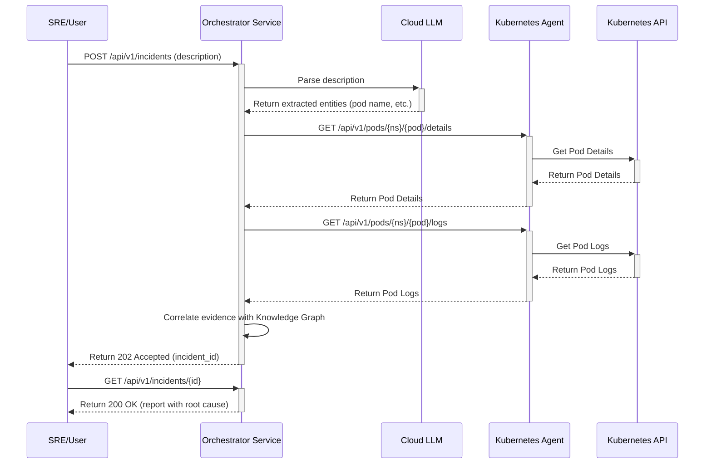

# Core Workflows

### Incident Investigation Flow



### Incident Triage Workflow (LangGraph)

The SRE Orchestrator leverages LangGraph to manage the stateful, multi-step incident triage process. This approach allows for a clear definition of the workflow, including automated steps and human-in-the-loop interventions.

**Workflow State:**
The core of the LangGraph workflow is a state object that encapsulates all relevant information about an incident as it progresses. This state is an extension of the `Incident` data model, enriched with transient data collected during the workflow execution.

**Key Stages (Nodes):**
The incident triage workflow is broken down into several distinct stages, each represented by a node in the LangGraph:

1.  **Incident Parsing**:
    *   **Purpose**: To extract key entities and context from the initial incident description provided by the SRE.
    *   **Mechanism**: Utilizes a Cloud LLM to perform natural language understanding and entity recognition.

2.  **Data Collection**:
    *   **Purpose**: To gather relevant diagnostic information from the affected systems.
    *   **Mechanism**: Interacts with specialized agents, suchs as the Kubernetes Agent, to retrieve data like pod details, logs, and events.

3.  **Root Cause Correlation**:
    *   **Purpose**: To analyze the collected data and identify the most probable root cause of the incident.
    *   **Mechanism**: Employs a correlation engine that processes the evidence, potentially leveraging a static knowledge graph for contextual information and historical patterns.

4.  **Action Plan Suggestion**:
    *   **Purpose**: To propose a set of remedial actions based on the identified root cause.
    *   **Mechanism**: Generates an actionable plan, which may involve further LLM processing or rule-based recommendations.

5.  **Human Review and Feedback**:
    *   **Purpose**: To allow an SRE to review the automated analysis, provide additional insights, or override suggestions.
    *   **Mechanism**: The workflow pauses, awaiting human input. This human feedback is then incorporated into the incident's record.

6.  **Finalization**:
    *   **Purpose**: To mark the incident as resolved, record the final outcome, and trigger any necessary post-triage actions.
    *   **Mechanism**: Updates the incident status, stores all collected data and conclusions, and can initiate notifications or reporting.

**Workflow Flow:**
The workflow progresses sequentially through these stages. The system is designed to handle the transition between automated steps and human intervention seamlessly, ensuring that all relevant data is carried forward and updated in the incident's state.

```mermaid
graph TD
    A[Start (Incident Ingested)] --> B(Incident Parsing)
    B --> C(Data Collection)
    C --> D(Root Cause Correlation)
    D --> E(Action Plan Suggestion)
    E --> F{Human Review and Feedback}
    F -- Human Input Received --> G(Finalization)
    G --> H[End (Incident Completed)]
```
