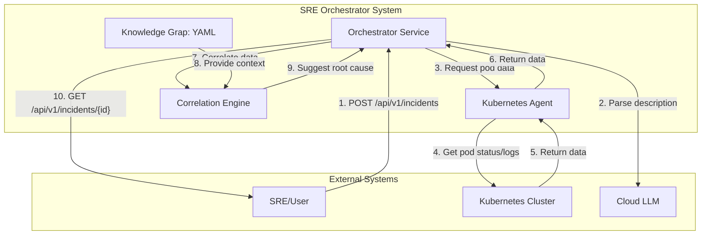

# High Level Architecture

### Technical Summary

The SRE Orchestrator will be a microservices-based system designed to automate incident response. The core components include the main Orchestrator service, a Kubernetes Agent, and future specialized agents, all communicating via internal REST APIs. The primary technology stack will be Python with FastAPI and LangGraph, containerized with Docker, and deployed on Kubernetes using Helm. This architecture directly supports the PRD's goal of creating a scalable and resilient system by isolating agent functionalities, enabling independent development and deployment.

### High Level Overview

The system will follow a Cloud Native **Microservices** architecture, as specified in the PRD, to promote scalability and resilience. All code will be managed in a **Monorepo** to simplify dependency management and maintain consistency across services. The primary data flow begins with an SRE triggering an investigation via a REST API call to the Orchestrator. The Orchestrator then uses an LLM to parse the request and delegates data collection tasks to the appropriate agent (initially, the Kubernetes Agent). The agent gathers data from the cluster and returns it to the Orchestrator, which then uses a correlation engine to analyze the findings and generate a root cause suggestion.

### High Level Project Diagram

### Architectural and Design Patterns

- **Architectural Style:** **Microservices**. This is mandated by the PRD to ensure scalability and resilience. Each agent will be a separate service.
- **Communication Pattern:** **Synchronous REST APIs** for internal service-to-service communication.
    - *Rationale:* For the initial implementation, direct REST calls are simple, well-understood, and sufficient for the request/response nature of the core workflows. Asynchronous patterns like Message Queues (e.g., RabbitMQ, SQS) could be introduced later if complex, long-running, or decoupled workflows are required.
- **Code Organization:** **Dependency Injection (DI)**.
    - *Rationale:* FastAPI has excellent built-in support for DI. This pattern will make the code more modular, testable, and maintainable by decoupling components from their concrete dependencies. It allows for easily swapping implementations, which is ideal for an agent-based system where different data sources or tools might be used in the future.
- **Data Storage (Incidents):** **In-Memory Storage (for MVP)**.
    - *Rationale:* The PRD for Epic 1 specifies an in-memory data store. This is sufficient for the initial development phase. This will be replaced by a persistent database in a future iteration. A **Repository Pattern** will be used to abstract the data access logic, making it easy to switch from the in-memory store to a database without changing the business logic.
