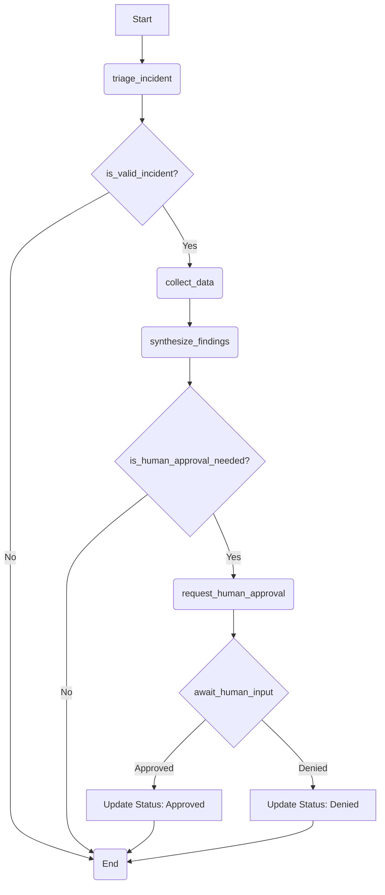

# LangGraph SRE Agent Workflow

## 1. Overview

This document outlines the architectural design for the agentic workflow responsible for SRE incident triage within the SRE Orchestrator. The design utilizes the `LangGraph` framework to create a stateful, graph-based workflow that is robust, extensible, and allows for human-in-the-loop verification.

The core of the design is a graph that processes an `Incident` object, enriches it with data, synthesizes a root cause hypothesis, and, when necessary, pauses for human approval before concluding.

## 2. Graph State

The state of the graph is the central data object that is passed between nodes. It is a `TypedDict` that contains the `Incident` Pydantic model, ensuring data consistency throughout the workflow.

```python
from typing import TypedDict
from app.models.incidents import Incident # Assuming location of the model

class GraphState(TypedDict):
    """
    Represents the state of our graph.

    Attributes:
        incident: The core incident object being processed.
    """
    incident: Incident
```

## 3. Graph Nodes (The Agents)

The nodes of the graph are Python functions that represent individual agents or tasks. Each node receives the current `GraphState` and can modify it.

1.  **`triage_incident`**:
    *   **Purpose**: The entry point of the graph. It takes the initial incident description, creates the `Incident` object, and performs a basic analysis to extract key entities.
    *   **Output**: Updates `incident.status` to "triaging".

2.  **`collect_data`**:
    *   **Purpose**: The **Data Collection Agent**. It queries external tools (via the MCP Server) like logging platforms or metrics dashboards to gather evidence related to the incident.
    *   **Output**: Populates the `incident.evidence` dictionary.

3.  **`synthesize_findings`**:
    *   **Purpose**: The **Synthesis Agent**. It reviews the collected `incident.evidence` and generates a hypothesis.
    *   **Output**: Updates `incident.suggested_root_cause` and `incident.confidence_score`.

4.  **`request_human_approval`**:
    *   **Purpose**: The **Human-in-the-Loop (HITL)** entry point. This node signals that the graph should pause and wait for external input from a human operator.
    *   **Output**: The `incident.status` is changed to "pending_approval".

## 4. Graph Edges and Workflow Logic

The edges connect the nodes and define the flow of control. Conditional edges are used to create branching logic based on the current state.



**Workflow Explanation:**
1.  The workflow begins at the `triage_incident` node.
2.  A conditional edge, `is_valid_incident`, checks if the incident has enough information to proceed.
3.  The `collect_data` agent gathers evidence, which is then processed by the `synthesize_findings` agent.
4.  A second conditional edge, `is_human_approval_needed`, determines if the synthesized findings require human verification (e.g., based on a confidence score).
5.  If approval is needed, the graph transitions to the `request_human_approval` node, which triggers a pause.
6.  The system then waits for a human to provide feedback, which will resume the graph to update the incident status and conclude the workflow.

## 5. Human-in-the-Loop (HITL) Implementation

The HITL mechanism is implemented by interrupting the graph execution. `LangGraph`'s persistence feature (a "checkpointer") is essential for this.

1.  When the graph reaches the `request_human_approval` node, its state is automatically saved by the checkpointer, and execution is paused.
2.  The application layer is responsible for notifying the human operator (e.g., via a Slack message or a UI update).
3.  The human operator provides feedback through an external mechanism (e.g., an API call).
4.  The application layer receives this feedback and uses it to update the graph's state. It then resumes execution from the paused step.

## 6. Illustrative Code Implementation

The following Python snippets demonstrate how this design translates into `LangGraph` code.

### Node and Edge Functions
```python
# Node functions
def triage_incident(state: GraphState) -> dict:
    print("---TRIAGING INCIDENT---")
    # ... implementation ...
    return {"incident": state['incident']}

def collect_data(state: GraphState) -> dict:
    print("---COLLECTING DATA---")
    # ... implementation ...
    return {"incident": state['incident']}

def synthesize_findings(state: GraphState) -> dict:
    print("---SYNTHESIZING FINDINGS---")
    # ... implementation ...
    return {"incident": state['incident']}

def request_human_approval(state: GraphState) -> dict:
    print("---REQUESTING HUMAN APPROVAL---")
    return {}

# Conditional edge functions
def is_valid_incident(state: GraphState) -> str:
    if state['incident'].description:
        return "collect_data"
    return "end"

def is_human_approval_needed(state: GraphState) -> str:
    if state['incident'].confidence_score == "high":
        return "end"
    return "request_human_approval"
```

### Graph Assembly
```python
from langgraph.graph import StateGraph, END

# Initialize the graph
workflow = StateGraph(GraphState)

# Add the nodes
workflow.add_node("triage_incident", triage_incident)
workflow.add_node("collect_data", collect_data)
workflow.add_node("synthesize_findings", synthesize_findings)
# Add the node that will pause the graph
workflow.add_node("request_human_approval", request_human_approval)

# Set the entry point
workflow.set_entry_point("triage_incident")

# Add the edges
workflow.add_conditional_edges("triage_incident", is_valid_incident, {"collect_data": "collect_data", "end": END})
workflow.add_edge("collect_data", "synthesize_findings")
workflow.add_conditional_edges("synthesize_findings", is_human_approval_needed, {"request_human_approval": "request_human_approval", "end": END})
# The graph will pause after this node
workflow.add_edge("request_human_approval", END)

# Compile the graph with a checkpointer
app = workflow.compile(checkpointer=...)
```
