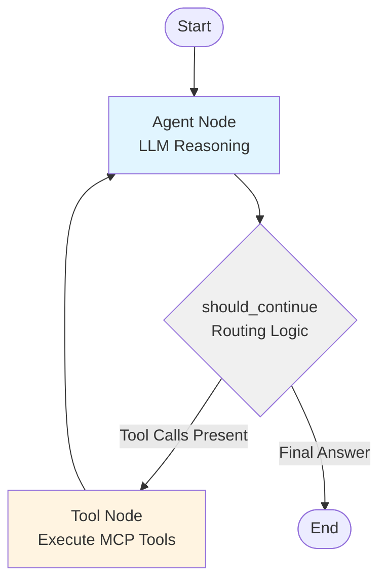
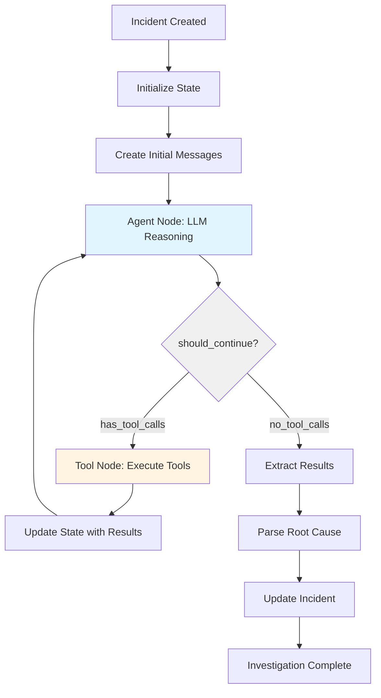
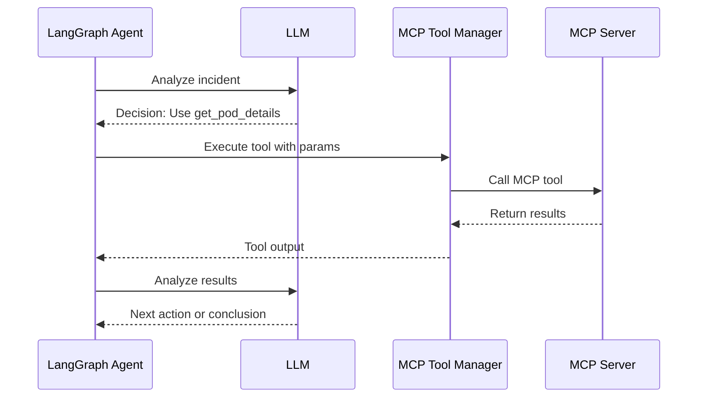

# LangGraph Workflow Documentation

## Overview

The SRE Orchestrator uses LangGraph's native StateGraph implementation with the ReAct (Reasoning + Acting) pattern to autonomously investigate incidents. This document explains how the workflow operates, the native graph structure, how MCP tools are integrated, and provides examples of agent investigations.

## Native LangGraph Implementation

The investigation agent uses a **native LangGraph StateGraph** implementation, which provides explicit control over the workflow graph structure. This approach offers several advantages over prebuilt agent functions:

- **Full Control**: Explicit definition of nodes, edges, and routing logic
- **Extensibility**: Easy to add new nodes (validation, human-in-the-loop, etc.)
- **Observability**: Comprehensive logging at each node transition
- **Customization**: Flexible routing logic and state management
- **Debugging**: Clear visibility into graph execution flow

## ReAct Agent Pattern

The ReAct pattern combines two key capabilities:

1. **Reasoning**: The LLM analyzes the situation and decides what to do next
2. **Acting**: The agent executes tools to gather information

This creates an autonomous investigation loop where the agent:
- Analyzes the incident description
- Determines what information is needed
- Selects and executes appropriate tools
- Interprets the results
- Continues until sufficient evidence is gathered
- Determines the root cause with confidence level

## Native StateGraph Architecture

### High-Level Graph Structure



### Detailed Investigation Flow



## Graph Components

### State Schema

The investigation workflow uses a well-defined state schema that flows through all nodes:

```python
from typing import TypedDict, Annotated, Sequence
from langchain_core.messages import BaseMessage
from langgraph.graph.message import add_messages

class InvestigationState(TypedDict):
    """State schema for the investigation workflow."""

    # Conversation history with automatic message appending
    messages: Annotated[Sequence[BaseMessage], add_messages]

    # Investigation metadata
    incident_id: str
    correlation_id: str
    investigation_status: str  # "in_progress", "completed", "failed"
```

**Key Features:**
- **`messages` field**: Uses the `add_messages` reducer annotation, which automatically appends new messages to the list when nodes return partial state updates
- **Metadata fields**: Track incident ID and correlation ID for logging and tracing
- **Status tracking**: Monitor investigation progress through the workflow
- **Extensible**: New fields can be added without breaking existing nodes

### Agent Node

The agent node invokes the LLM for reasoning and decision-making:

```python
async def agent_node(state: InvestigationState) -> InvestigationState:
    """
    Agent node that invokes the LLM for reasoning and decision-making.

    This node:
    1. Takes the current state (including message history)
    2. Invokes the LLM with tools bound
    3. Returns updated state with LLM response
    """
    correlation_id = state.get("correlation_id")
    incident_id = state.get("incident_id")

    # Invoke the LLM with current messages
    response = await model_with_tools.ainvoke(state["messages"])

    # Return partial state update - add_messages reducer appends the response
    return {"messages": [response]}
```

**Responsibilities:**
- Invoke LLM with current conversation history
- Handle errors and update investigation status
- Use retry logic for transient failures
- Log execution with correlation ID

### Tool Node

The tool node executes tools requested by the LLM:

```python
from langgraph.prebuilt import ToolNode

# Create tool node with MCP tools
tool_node = ToolNode(mcp_tools)
```

The tool node is wrapped with custom logging for observability:

```python
async def tool_node_with_logging(state: InvestigationState):
    """Tool node with comprehensive logging."""
    # Log tool invocations
    # Execute tools using LangGraph's ToolNode
    # Log tool results with timing information
    # Handle errors gracefully
    return result
```

**Responsibilities:**
- Execute tools requested by the LLM
- Log tool invocations and results
- Handle tool execution errors
- Return tool results as ToolMessage objects

### Routing Logic

The routing function determines the next step after agent execution:

```python
def should_continue(state: InvestigationState) -> Literal["tools", "end"]:
    """
    Routing function to determine if workflow should continue to tools or end.

    Checks the last message from the agent:
    - If it contains tool calls, route to "tools"
    - If it's a final answer, route to "end"
    """
    messages = state["messages"]
    last_message = messages[-1]

    # Check if the last message has tool calls
    has_tool_calls = hasattr(last_message, "tool_calls") and bool(last_message.tool_calls)

    if has_tool_calls:
        return "tools"
    else:
        return "end"
```

**Routing Decisions:**
- **"tools"**: LLM requested tool execution → route to tool node
- **"end"**: LLM provided final answer → complete investigation

**Extensibility:**
The routing logic can be extended to support:
- Maximum iteration limits
- Confidence thresholds for early termination
- Validation requirements before completion
- Multi-phase investigation workflows

### Graph Construction

The graph is constructed by assembling nodes and edges:

```python
from langgraph.graph import StateGraph, END

# Create the state graph with InvestigationState schema
graph = StateGraph(InvestigationState)

# Add nodes
graph.add_node("agent", agent_node)
graph.add_node("tools", tool_node)

# Add conditional edges from agent
graph.add_conditional_edges(
    "agent",
    should_continue,
    {
        "tools": "tools",  # If should_continue returns "tools"
        "end": END         # If should_continue returns "end"
    }
)

# Add edge from tools back to agent
graph.add_edge("tools", "agent")

# Set entry point
graph.set_entry_point("agent")

# Compile the graph
agent = graph.compile()
```

**Graph Execution:**
1. Start at agent node (entry point)
2. Agent invokes LLM for reasoning
3. Routing function checks for tool calls
4. If tool calls exist, execute tools and return to agent
5. If no tool calls, end investigation
6. Extract and return results

### System Prompt

The agent is guided by a system prompt that defines its role and behavior:

```python
system_prompt = """You are an expert SRE assistant investigating production incidents.

When given an incident description, follow this process:
1. Analyze the description to understand the problem
2. Use available Kubernetes tools to gather evidence:
   - Get pod details and status
   - Retrieve pod logs
   - Check resource usage and limits
   - View recent events
3. Correlate the evidence to identify patterns
4. Determine the root cause with confidence level
5. Provide actionable recommendations

Always explain your reasoning and cite specific evidence from the tools."""
```

### LLM Configuration

The agent uses LangChain's `init_chat_model` for flexible LLM provider support:

```python
model = init_chat_model(
    model=os.getenv("LLM_MODEL", "gpt-4"),
    base_url=os.getenv("LLM_BASE_URL"),
    api_key=os.getenv("LLM_API_KEY")
)
```

Supported providers:
- OpenAI (GPT-4, GPT-3.5)
- Google Gemini (via OpenAI-compatible proxy)
- Local LLMs (Ollama, LM Studio, etc.)

### Tool Integration

Tools are provided by MCP servers and automatically converted to LangChain format:

```python
# Initialize MCP client
mcp_client = MultiServerMCPClient(mcp_config)

# Get all tools from all connected MCP servers
tools = await mcp_client.get_tools()

# Create native LangGraph agent with tools
agent = await create_investigation_agent_native(
    mcp_tools=tools,
    llm_config={
        "base_url": os.getenv("LLM_BASE_URL"),
        "api_key": os.getenv("LLM_API_KEY"),
        "model_name": os.getenv("LLM_MODEL", "gpt-4"),
        "temperature": 0.7,
        "max_tokens": 2000
    },
    correlation_id=correlation_id
)
```

### Investigation Execution

The investigation is executed by invoking the compiled graph with initial state:

```python
# Create initial state
initial_state = {
    "messages": [
        SystemMessage(content=INVESTIGATION_SYSTEM_PROMPT),
        HumanMessage(content=incident_description)
    ],
    "incident_id": incident_id,
    "correlation_id": correlation_id,
    "investigation_status": "in_progress"
}

# Invoke the agent
result = await agent.ainvoke(initial_state)

# Extract results from final state
messages = result.get("messages", [])
final_message = messages[-1]

# Parse structured information
root_cause = extract_root_cause(final_message.content)
confidence = extract_confidence(final_message.content)
evidence = extract_evidence(messages)
recommendations = extract_recommendations(final_message.content)
```

## MCP Tool Integration

### Tool Discovery

When the orchestrator starts, it connects to all configured MCP servers and discovers available tools:

```python
# From mcp_config.yaml
mcp_servers:
  kubernetes:
    url: "http://kubernetes-mcp-server:8080/mcp"
    transport: "streamable_http"
  prometheus:
    command: "python"
    args: ["/path/to/prometheus_server.py"]
    transport: "stdio"
```

Each MCP server exposes tools that the agent can use:

**Kubernetes MCP Tools:**
- `get_pod_details`: Get pod status, conditions, and configuration
- `get_pod_logs`: Retrieve pod logs with optional tail and timestamps
- `get_pod_events`: Get recent events for a pod
- `list_pods`: List pods in a namespace with filtering

**Prometheus MCP Tools:**
- `query_metrics`: Execute PromQL queries
- `get_alerts`: Retrieve active alerts
- `get_metric_history`: Get time-series data for a metric

### Tool Execution Flow



### Tool Error Handling

The agent handles tool failures gracefully:

```python
try:
    result = await tool.execute(params)
except MCPToolError as e:
    # Log error
    logger.error(f"Tool execution failed: {e}")
    # Agent continues with available information
    # LLM decides whether to retry or use alternative approach
```

## Investigation Examples

### Example 1: CrashLoopBackOff Investigation

**Incident Description:**
```
Pod auth-service-xyz is in CrashLoopBackOff in namespace production
```

**Agent Investigation Steps:**

1. **Initial Reasoning**
   ```
   LLM: "The pod is in CrashLoopBackOff, which means it's repeatedly crashing.
   I need to check the pod details to understand the current state and then
   examine the logs to see why it's crashing."
   ```

2. **Tool: get_pod_details**
   ```python
   tool_call = {
       "name": "get_pod_details",
       "arguments": {
           "namespace": "production",
           "pod_name": "auth-service-xyz"
       }
   }
   ```

   **Result:**
   ```json
   {
       "status": "CrashLoopBackOff",
       "restart_count": 15,
       "last_state": {
           "terminated": {
               "exit_code": 1,
               "reason": "Error"
           }
       },
       "containers": [{
           "name": "auth-service",
           "image": "auth-service:v2.1.0",
           "ready": false
       }]
   }
   ```

3. **Reasoning After Tool Result**
   ```
   LLM: "The pod has restarted 15 times with exit code 1. This indicates an
   application error. I need to check the logs to see the specific error message."
   ```

4. **Tool: get_pod_logs**
   ```python
   tool_call = {
       "name": "get_pod_logs",
       "arguments": {
           "namespace": "production",
           "pod_name": "auth-service-xyz",
           "tail": 50
       }
   }
   ```

   **Result:**
   ```
   2024-01-15 10:23:45 ERROR Failed to connect to database
   2024-01-15 10:23:45 ERROR Connection refused: postgresql://db:5432
   2024-01-15 10:23:45 FATAL Application startup failed
   ```

5. **Final Analysis**
   ```
   LLM: "Based on the evidence:
   1. Pod is crashing with exit code 1
   2. Logs show database connection failure
   3. Error: Connection refused to postgresql://db:5432

   Root Cause: The auth-service cannot connect to the PostgreSQL database.
   The database service may be down, or there may be a network connectivity issue.

   Confidence: High

   Recommendations:
   1. Check if the PostgreSQL service is running
   2. Verify network policies allow traffic from production namespace to database
   3. Confirm database credentials are correct
   4. Check if database is accepting connections"
   ```

### Example 2: OOMKilled Investigation

**Incident Description:**
```
Payment service pods are being OOMKilled in the prod namespace
```

**Agent Investigation Steps:**

1. **Initial Reasoning**
   ```
   LLM: "OOMKilled means the pod exceeded its memory limit. I need to check
   the pod details to see the memory limits and usage, then examine logs to
   understand what caused the high memory usage."
   ```

2. **Tool: list_pods**
   ```python
   tool_call = {
       "name": "list_pods",
       "arguments": {
           "namespace": "prod",
           "label_selector": "app=payment-service"
       }
   }
   ```

   **Result:**
   ```json
   {
       "pods": [
           {
               "name": "payment-service-abc",
               "status": "Running",
               "restart_count": 3,
               "last_state": {
                   "terminated": {
                       "reason": "OOMKilled"
                   }
               }
           }
       ]
   }
   ```

3. **Tool: get_pod_details**
   ```python
   tool_call = {
       "name": "get_pod_details",
       "arguments": {
           "namespace": "prod",
           "pod_name": "payment-service-abc"
       }
   }
   ```

   **Result:**
   ```json
   {
       "resources": {
           "limits": {
               "memory": "512Mi"
           },
           "requests": {
               "memory": "256Mi"
           }
       },
       "status": {
           "container_statuses": [{
               "last_state": {
                   "terminated": {
                       "reason": "OOMKilled",
                       "exit_code": 137
                   }
               }
           }]
       }
   }
   ```

4. **Tool: get_pod_logs**
   ```python
   tool_call = {
       "name": "get_pod_logs",
       "arguments": {
           "namespace": "prod",
           "pod_name": "payment-service-abc",
           "previous": true,
           "tail": 100
       }
   }
   ```

   **Result:**
   ```
   2024-01-15 14:30:12 INFO Processing batch payment job
   2024-01-15 14:30:15 INFO Loading 50000 transactions into memory
   2024-01-15 14:30:18 WARN Memory usage: 480MB
   2024-01-15 14:30:20 WARN Memory usage: 510MB
   ```

5. **Final Analysis**
   ```
   LLM: "Based on the evidence:
   1. Pod has memory limit of 512Mi
   2. Pod was OOMKilled (exit code 137)
   3. Logs show batch job loading 50000 transactions
   4. Memory usage reached 510MB before termination

   Root Cause: The payment service's batch processing job loads too much data
   into memory, exceeding the 512Mi limit. The memory limit is insufficient
   for the workload.

   Confidence: High

   Recommendations:
   1. Increase memory limit to at least 1Gi
   2. Optimize batch processing to use streaming instead of loading all data
   3. Implement pagination for large transaction sets
   4. Add memory usage monitoring and alerts"
   ```

### Example 3: Network Connectivity Issue

**Incident Description:**
```
API gateway is returning 503 errors when calling user-service
```

**Agent Investigation Steps:**

1. **Initial Reasoning**
   ```
   LLM: "503 errors typically indicate service unavailability. I need to check
   if the user-service pods are running and healthy, then examine the API
   gateway logs to see the specific error."
   ```

2. **Tool: list_pods**
   ```python
   tool_call = {
       "name": "list_pods",
       "arguments": {
           "namespace": "default",
           "label_selector": "app=user-service"
       }
   }
   ```

   **Result:**
   ```json
   {
       "pods": [
           {
               "name": "user-service-123",
               "status": "Running",
               "ready": "1/1"
           },
           {
               "name": "user-service-456",
               "status": "Running",
               "ready": "1/1"
           }
       ]
   }
   ```

3. **Reasoning**
   ```
   LLM: "The user-service pods are running and ready. The issue might be with
   the API gateway's ability to reach them. Let me check the API gateway logs."
   ```

4. **Tool: get_pod_logs**
   ```python
   tool_call = {
       "name": "get_pod_logs",
       "arguments": {
           "namespace": "default",
           "label_selector": "app=api-gateway",
           "tail": 50
       }
   }
   ```

   **Result:**
   ```
   2024-01-15 16:45:23 ERROR Failed to connect to user-service.default.svc.cluster.local:8080
   2024-01-15 16:45:23 ERROR Connection timeout after 5s
   2024-01-15 16:45:23 WARN Returning 503 Service Unavailable
   ```

5. **Tool: get_pod_events**
   ```python
   tool_call = {
       "name": "get_pod_events",
       "arguments": {
           "namespace": "default",
           "pod_name": "user-service-123"
       }
   }
   ```

   **Result:**
   ```
   No recent events found
   ```

6. **Final Analysis**
   ```
   LLM: "Based on the evidence:
   1. User-service pods are running and ready
   2. API gateway cannot connect to user-service
   3. Connection timeout after 5 seconds
   4. No pod events indicating issues

   Root Cause: Network connectivity issue between API gateway and user-service.
   The pods are healthy but cannot communicate. This is likely a NetworkPolicy
   or Service configuration issue.

   Confidence: Medium (would need to check NetworkPolicies and Service config)

   Recommendations:
   1. Verify Service 'user-service' exists and has correct selector
   2. Check NetworkPolicies in default namespace
   3. Verify Service endpoints are populated
   4. Test connectivity from API gateway pod using curl/nc
   5. Check if Service port matches container port"
   ```

## Agent Configuration

### Environment Variables

```bash
# LLM Configuration
LLM_BASE_URL=https://api.openai.com/v1
LLM_API_KEY=sk-...
LLM_MODEL=gpt-4

# MCP Configuration
MCP_CONFIG_PATH=/app/mcp_config.yaml
```

### MCP Configuration File

```yaml
mcp_servers:
  kubernetes:
    url: "http://kubernetes-mcp-server:8080/mcp"
    transport: "streamable_http"
    headers:
      Authorization: "Bearer ${K8S_MCP_TOKEN}"

  prometheus:
    url: "http://prometheus-mcp-server:9090/mcp"
    transport: "streamable_http"
```

## Monitoring and Observability

### Agent Metrics

The system tracks key metrics for agent performance:

```python
# Workflow execution time
workflow_execution_duration_seconds

# Tool execution time
mcp_tool_execution_duration_seconds{tool_name="get_pod_details"}

# LLM call metrics
llm_request_duration_seconds{operation="reasoning"}
llm_tokens_used_total{operation="reasoning"}

# Investigation outcomes
investigation_completed_total{status="success"}
investigation_completed_total{status="failed"}
```

### Logging

All agent actions are logged with structured context:

```json
{
  "timestamp": "2024-01-15T10:23:45Z",
  "level": "INFO",
  "incident_id": "123e4567-e89b-12d3-a456-426614174000",
  "event": "tool_executed",
  "tool_name": "get_pod_details",
  "tool_args": {
    "namespace": "production",
    "pod_name": "auth-service-xyz"
  },
  "execution_time_ms": 234,
  "success": true
}
```

## Best Practices

### System Prompt Design

1. **Be Specific**: Clearly define the agent's role and responsibilities
2. **Provide Structure**: Outline the investigation process step-by-step
3. **Set Expectations**: Explain what constitutes a complete investigation
4. **Encourage Transparency**: Ask the agent to explain its reasoning

### Tool Design

1. **Single Responsibility**: Each tool should do one thing well
2. **Clear Parameters**: Use descriptive parameter names and types
3. **Comprehensive Output**: Return all relevant information
4. **Error Messages**: Provide actionable error messages

### Investigation Quality

1. **Evidence-Based**: All conclusions should cite specific evidence
2. **Confidence Levels**: Always include confidence assessment
3. **Actionable Recommendations**: Provide specific next steps
4. **Transparent Reasoning**: Log all decision points

## Troubleshooting

### Agent Not Using Tools

**Symptom**: Agent provides generic responses without using tools

**Possible Causes**:
1. Tools not properly registered with agent
2. System prompt doesn't encourage tool use
3. LLM model doesn't support function calling

**Solutions**:
1. Verify tools are loaded: Check MCP connection logs
2. Update system prompt to explicitly mention available tools
3. Use a model that supports function calling (GPT-4, GPT-3.5-turbo)

### Tool Execution Failures

**Symptom**: Tools fail to execute or return errors

**Possible Causes**:
1. MCP server not reachable
2. Invalid tool parameters
3. Insufficient permissions

**Solutions**:
1. Check MCP server health endpoints
2. Validate tool parameters match schema
3. Verify service account permissions

### Incomplete Investigations

**Symptom**: Agent stops before gathering sufficient evidence

**Possible Causes**:
1. Token limit reached
2. Agent thinks it has enough information
3. Tool execution timeout

**Solutions**:
1. Increase max_tokens in LLM config
2. Adjust system prompt to require more evidence
3. Increase tool execution timeout

## Extending the Graph

The native StateGraph implementation makes it easy to extend the investigation workflow. See [extending-investigation-graph.md](./extending-investigation-graph.md) for detailed examples.

### Common Extensions

**Adding a Validation Node:**
```python
async def validation_node(state: InvestigationState):
    """Validate investigation results before completing."""
    # Check if root cause is identified
    # Check if confidence is acceptable
    # Return state with validation status
    pass

graph.add_node("validation", validation_node)
graph.add_conditional_edges("agent", should_continue, {
    "tools": "tools",
    "validate": "validation",
    "end": END
})
```

**Adding Maximum Iterations:**
```python
class InvestigationState(TypedDict):
    messages: Annotated[Sequence[BaseMessage], add_messages]
    incident_id: str
    correlation_id: str
    investigation_status: str
    iteration_count: int  # New field

def should_continue(state: InvestigationState) -> Literal["tools", "end"]:
    # Check iteration limit
    if state.get("iteration_count", 0) > 5:
        return "end"

    # Check for tool calls
    last_message = state["messages"][-1]
    has_tool_calls = hasattr(last_message, "tool_calls") and bool(last_message.tool_calls)

    return "tools" if has_tool_calls else "end"
```

**Adding Human-in-the-Loop:**
```python
async def human_approval_node(state: InvestigationState):
    """Wait for human approval before completing."""
    # Send notification to human
    # Wait for approval
    # Return state with approval status
    pass

graph.add_node("human_approval", human_approval_node)
graph.add_edge("validation", "human_approval")
graph.add_edge("human_approval", END)
```

## Future Enhancements

### Planned Features

1. **Multi-Agent Collaboration**: Multiple specialized agents working together
2. **Investigation Checkpointing**: Save and resume long-running investigations using LangGraph's built-in checkpointing
3. **Learning from Past Incidents**: Use historical data to improve investigations
4. **Custom Tool Development**: Framework for creating domain-specific tools
5. **Streaming Responses**: Real-time investigation progress updates using LangGraph streaming

### Extensibility

The native StateGraph implementation is highly extensible:

- **New Nodes**: Add validation, enrichment, or approval nodes
- **Custom Routing**: Implement complex routing logic based on state
- **State Extensions**: Add new fields to track additional information
- **New MCP Servers**: Just add to configuration, tools automatically available
- **Custom Prompts**: Modify system prompt for different investigation styles
- **Alternative LLMs**: Swap LLM provider via environment variables
- **Tool Filtering**: Selectively enable/disable tools per investigation type

## Implementation Details

### Implementation

The system uses the native LangGraph StateGraph implementation exclusively:

```python
# Create investigation agent
agent = await create_investigation_agent(
    mcp_tools=tools,
    llm_config=config,
    correlation_id="corr-123"
)
```

The native implementation provides:
- Explicit control over workflow graph structure
- Better observability with comprehensive logging
- Easier extensibility for custom nodes and routing
- Full backward compatibility with existing API
