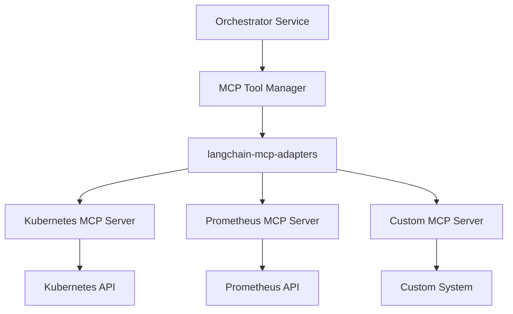

# MCP Integration Guide

## Overview

The SRE Orchestrator uses the Model Context Protocol (MCP) to integrate with external systems and tools. MCP provides a standardized way for the LangGraph agent to discover and execute tools from various sources without requiring code changes to the orchestrator.

This guide explains how to configure MCP servers, add new servers, and create custom MCP tools.

## What is MCP?

Model Context Protocol (MCP) is an open protocol that standardizes how applications provide context to LLMs. In the SRE Orchestrator, MCP servers expose tools that the LangGraph agent can use to gather information from external systems.

**Key Benefits:**
- **Standardized Interface**: All tools follow the same protocol
- **Dynamic Discovery**: Tools are discovered at runtime
- **No Code Changes**: Add new capabilities by deploying MCP servers
- **Separation of Concerns**: Tool logic is separate from orchestrator logic

## Architecture



## MCP Server Configuration

### Configuration File Format

MCP servers are configured in `mcp_config.yaml`:

```yaml
mcp_servers:
  # HTTP-based MCP server
  kubernetes:
    url: "http://kubernetes-mcp-server:8080/mcp"
    transport: "streamable_http"
    headers:
      Authorization: "Bearer ${K8S_MCP_TOKEN}"

  # Stdio-based MCP server (subprocess)
  prometheus:
    command: "python"
    args: ["/app/mcp_servers/prometheus_server.py"]
    transport: "stdio"
    env:
      PROMETHEUS_URL: "http://prometheus:9090"

  # Another HTTP server with custom timeout
  custom_tool:
    url: "http://custom-mcp:3000/mcp"
    transport: "streamable_http"
    timeout: 30
```

### Transport Types

#### streamable_http

Used for remote MCP servers accessible via HTTP.

**Configuration:**
```yaml
server_name:
  url: "http://hostname:port/mcp"
  transport: "streamable_http"
  headers:  # Optional
    Authorization: "Bearer token"
    Custom-Header: "value"
  timeout: 30  # Optional, seconds
```

**Use Cases:**
- Production deployments
- Shared MCP servers
- Servers in different namespaces/clusters

#### stdio

Used for local MCP servers running as subprocesses.

**Configuration:**
```yaml
server_name:
  command: "python"  # or "node", "go", etc.
  args: ["/path/to/server.py", "--arg1", "value1"]
  transport: "stdio"
  env:  # Optional
    VAR_NAME: "value"
```

**Use Cases:**
- Development and testing
- Lightweight tools
- Tools that need local file access

### Environment Variable Substitution

Configuration values can reference environment variables:

```yaml
mcp_servers:
  kubernetes:
    url: "${K8S_MCP_URL}"
    transport: "streamable_http"
    headers:
      Authorization: "Bearer ${K8S_MCP_TOKEN}"
```

Set environment variables in the deployment:
```yaml
env:
  - name: K8S_MCP_URL
    value: "http://kubernetes-mcp-server:8080/mcp"
  - name: K8S_MCP_TOKEN
    valueFrom:
      secretKeyRef:
        name: mcp-credentials
        key: k8s-token
```

## Adding New MCP Servers

### Step 1: Deploy the MCP Server

Deploy your MCP server to the Kubernetes cluster:

```yaml
apiVersion: apps/v1
kind: Deployment
metadata:
  name: my-mcp-server
  namespace: sre
spec:
  replicas: 1
  selector:
    matchLabels:
      app: my-mcp-server
  template:
    metadata:
      labels:
        app: my-mcp-server
    spec:
      containers:
      - name: server
        image: my-mcp-server:latest
        ports:
        - containerPort: 8080
---
apiVersion: v1
kind: Service
metadata:
  name: my-mcp-server
  namespace: sre
spec:
  selector:
    app: my-mcp-server
  ports:
  - port: 8080
    targetPort: 8080
```

### Step 2: Update MCP Configuration

Add the server to `mcp_config.yaml`:

```yaml
mcp_servers:
  # ... existing servers ...

  my_custom_server:
    url: "http://my-mcp-server:8080/mcp"
    transport: "streamable_http"
```

### Step 3: Update ConfigMap

If using Kubernetes ConfigMap for configuration:

```bash
kubectl create configmap mcp-config \
  --from-file=mcp_config.yaml \
  --namespace=sre \
  --dry-run=client -o yaml | kubectl apply -f -
```

### Step 4: Restart Orchestrator

The orchestrator will automatically discover tools from the new server:

```bash
kubectl rollout restart deployment/orchestrator -n sre
```

### Step 5: Verify Tool Discovery

Check the orchestrator logs to confirm tools were discovered:

```bash
kubectl logs -n sre deployment/orchestrator | grep "Discovered tools"
```

Expected output:
```
INFO: Discovered tools from my_custom_server: ['tool1', 'tool2', 'tool3']
```

## Creating Custom MCP Tools

### Tool Structure

An MCP tool consists of:

1. **Tool Definition**: Metadata describing the tool
2. **Tool Implementation**: The actual logic
3. **MCP Server**: Exposes the tool via MCP protocol

### Example: Simple MCP Server (Python)

```python
#!/usr/bin/env python3
"""
Simple MCP server that provides a tool to check service health.
"""
import asyncio
import json
import sys
from typing import Any, Dict

import httpx


class HealthCheckMCPServer:
    """MCP server for health checking services."""

    def __init__(self):
        self.tools = {
            "check_service_health": {
                "name": "check_service_health",
                "description": "Check if a service is healthy by calling its health endpoint",
                "inputSchema": {
                    "type": "object",
                    "properties": {
                        "service_url": {
                            "type": "string",
                            "description": "The base URL of the service (e.g., http://my-service:8080)"
                        },
                        "health_path": {
                            "type": "string",
                            "description": "The health check path (default: /health)",
                            "default": "/health"
                        }
                    },
                    "required": ["service_url"]
                }
            }
        }

    async def handle_request(self, request: Dict[str, Any]) -> Dict[str, Any]:
        """Handle incoming MCP requests."""
        method = request.get("method")

        if method == "tools/list":
            return {
                "tools": list(self.tools.values())
            }

        elif method == "tools/call":
            tool_name = request["params"]["name"]
            arguments = request["params"].get("arguments", {})

            if tool_name == "check_service_health":
                result = await self.check_service_health(**arguments)
                return {"content": [{"type": "text", "text": json.dumps(result)}]}

            else:
                return {"error": f"Unknown tool: {tool_name}"}

        else:
            return {"error": f"Unknown method: {method}"}

    async def check_service_health(
        self,
        service_url: str,
        health_path: str = "/health"
    ) -> Dict[str, Any]:
        """Check service health."""
        url = f"{service_url.rstrip('/')}{health_path}"

        try:
            async with httpx.AsyncClient() as client:
                response = await client.get(url, timeout=5.0)

                return {
                    "healthy": response.status_code == 200,
                    "status_code": response.status_code,
                    "response_time_ms": response.elapsed.total_seconds() * 1000,
                    "body": response.text[:500]  # Truncate long responses
                }

        except httpx.TimeoutException:
            return {
                "healthy": False,
                "error": "Request timeout after 5 seconds"
            }

        except Exception as e:
            return {
                "healthy": False,
                "error": str(e)
            }

    async def run_stdio(self):
        """Run server using stdio transport."""
        while True:
            try:
                # Read JSON-RPC request from stdin
                line = await asyncio.get_event_loop().run_in_executor(
                    None, sys.stdin.readline
                )

                if not line:
                    break

                request = json.loads(line)
                response = await self.handle_request(request)

                # Write JSON-RPC response to stdout
                response["jsonrpc"] = "2.0"
                response["id"] = request.get("id")
                print(json.dumps(response), flush=True)

            except Exception as e:
                error_response = {
                    "jsonrpc": "2.0",
                    "id": None,
                    "error": {"code": -32603, "message": str(e)}
                }
                print(json.dumps(error_response), flush=True)


if __name__ == "__main__":
    server = HealthCheckMCPServer()
    asyncio.run(server.run_stdio())
```

### Example: HTTP MCP Server (FastAPI)

```python
#!/usr/bin/env python3
"""
HTTP-based MCP server using FastAPI.
"""
from fastapi import FastAPI, Request
from pydantic import BaseModel
from typing import Any, Dict, List, Optional
import httpx

app = FastAPI()


class ToolDefinition(BaseModel):
    name: str
    description: str
    inputSchema: Dict[str, Any]


class ToolCallRequest(BaseModel):
    name: str
    arguments: Dict[str, Any]


class MCPRequest(BaseModel):
    jsonrpc: str = "2.0"
    id: Optional[int] = None
    method: str
    params: Optional[Dict[str, Any]] = None


@app.post("/mcp")
async def handle_mcp_request(request: MCPRequest):
    """Handle MCP protocol requests."""

    if request.method == "tools/list":
        return {
            "jsonrpc": "2.0",
            "id": request.id,
            "result": {
                "tools": [
                    {
                        "name": "check_service_health",
                        "description": "Check if a service is healthy",
                        "inputSchema": {
                            "type": "object",
                            "properties": {
                                "service_url": {
                                    "type": "string",
                                    "description": "Service base URL"
                                }
                            },
                            "required": ["service_url"]
                        }
                    }
                ]
            }
        }

    elif request.method == "tools/call":
        tool_name = request.params["name"]
        arguments = request.params.get("arguments", {})

        if tool_name == "check_service_health":
            result = await check_service_health(**arguments)
            return {
                "jsonrpc": "2.0",
                "id": request.id,
                "result": {
                    "content": [
                        {"type": "text", "text": str(result)}
                    ]
                }
            }

        return {
            "jsonrpc": "2.0",
            "id": request.id,
            "error": {"code": -32601, "message": f"Unknown tool: {tool_name}"}
        }

    return {
        "jsonrpc": "2.0",
        "id": request.id,
        "error": {"code": -32601, "message": f"Unknown method: {request.method}"}
    }


async def check_service_health(service_url: str) -> Dict[str, Any]:
    """Check service health."""
    try:
        async with httpx.AsyncClient() as client:
            response = await client.get(f"{service_url}/health", timeout=5.0)
            return {
                "healthy": response.status_code == 200,
                "status_code": response.status_code
            }
    except Exception as e:
        return {"healthy": False, "error": str(e)}


if __name__ == "__main__":
    import uvicorn
    uvicorn.run(app, host="0.0.0.0", port=8080)
```

## Tool Design Best Practices

### 1. Clear Tool Names

Use descriptive, action-oriented names:

✅ Good:
- `get_pod_details`
- `query_prometheus_metrics`
- `check_service_health`

❌ Bad:
- `pod`
- `metrics`
- `check`

### 2. Comprehensive Descriptions

Provide detailed descriptions that help the LLM understand when to use the tool:

```python
{
    "name": "get_pod_logs",
    "description": """
    Retrieve logs from a Kubernetes pod. Use this tool when you need to:
    - Investigate application errors or crashes
    - Check what the application was doing before a failure
    - Verify application startup sequence

    The tool returns the most recent log lines. Use the 'tail' parameter to
    control how many lines to retrieve. Use 'previous=true' to get logs from
    the previous container instance if the pod has restarted.
    """,
    "inputSchema": { ... }
}
```

### 3. Well-Defined Input Schemas

Use JSON Schema to define clear parameter requirements:

```python
{
    "inputSchema": {
        "type": "object",
        "properties": {
            "namespace": {
                "type": "string",
                "description": "Kubernetes namespace where the pod is located"
            },
            "pod_name": {
                "type": "string",
                "description": "Name of the pod"
            },
            "tail": {
                "type": "integer",
                "description": "Number of lines to retrieve from the end of the logs",
                "default": 100,
                "minimum": 1,
                "maximum": 10000
            },
            "previous": {
                "type": "boolean",
                "description": "Get logs from previous container instance (for restarted pods)",
                "default": false
            }
        },
        "required": ["namespace", "pod_name"]
    }
}
```

### 4. Structured Output

Return structured data that's easy for the LLM to parse:

```python
# Good: Structured output
{
    "status": "success",
    "pod_name": "auth-service-xyz",
    "namespace": "production",
    "logs": [
        "2024-01-15 10:23:45 ERROR Failed to connect to database",
        "2024-01-15 10:23:45 FATAL Application startup failed"
    ],
    "truncated": false,
    "line_count": 2
}

# Bad: Unstructured output
"Pod auth-service-xyz logs:\nERROR Failed to connect\nFATAL Startup failed"
```

### 5. Error Handling

Always return structured errors:

```python
{
    "status": "error",
    "error_code": "POD_NOT_FOUND",
    "error_message": "Pod 'auth-service-xyz' not found in namespace 'production'",
    "suggestions": [
        "Check if the pod name is correct",
        "Verify the namespace is correct",
        "List pods in the namespace to see available pods"
    ]
}
```

## Testing MCP Tools

### Manual Testing with curl

Test HTTP MCP servers directly:

```bash
# List available tools
curl -X POST http://localhost:8080/mcp \
  -H "Content-Type: application/json" \
  -d '{
    "jsonrpc": "2.0",
    "id": 1,
    "method": "tools/list"
  }'

# Call a tool
curl -X POST http://localhost:8080/mcp \
  -H "Content-Type: application/json" \
  -d '{
    "jsonrpc": "2.0",
    "id": 2,
    "method": "tools/call",
    "params": {
      "name": "check_service_health",
      "arguments": {
        "service_url": "http://my-service:8080"
      }
    }
  }'
```

### Testing with Python

```python
import asyncio
from langchain_mcp_adapters.client import MultiServerMCPClient

async def test_mcp_tools():
    # Configure MCP client
    config = {
        "my_server": {
            "url": "http://localhost:8080/mcp",
            "transport": "streamable_http"
        }
    }

    # Initialize client
    client = MultiServerMCPClient(config)

    # Get tools
    tools = await client.get_tools()
    print(f"Discovered {len(tools)} tools")

    for tool in tools:
        print(f"- {tool.name}: {tool.description}")

    # Execute a tool
    result = await tools[0].ainvoke({
        "service_url": "http://my-service:8080"
    })
    print(f"Result: {result}")

asyncio.run(test_mcp_tools())
```

## Common MCP Servers

### Kubernetes MCP Server

**Repository**: https://github.com/Andrea-Campanella/mcp-server-kubernetes

**Tools Provided**:
- `get_pod_details`: Get pod status and configuration
- `get_pod_logs`: Retrieve pod logs
- `list_pods`: List pods with filtering
- `get_pod_events`: Get recent events for a pod
- `describe_deployment`: Get deployment details

**Configuration**:
```yaml
mcp_servers:
  kubernetes:
    url: "http://kubernetes-mcp-server:8080/mcp"
    transport: "streamable_http"
```

### Prometheus MCP Server

**Tools Provided**:
- `query_metrics`: Execute PromQL queries
- `query_range`: Execute range queries
- `get_alerts`: Retrieve active alerts
- `get_targets`: List Prometheus targets

**Configuration**:
```yaml
mcp_servers:
  prometheus:
    command: "python"
    args: ["/app/prometheus_mcp_server.py"]
    transport: "stdio"
    env:
      PROMETHEUS_URL: "http://prometheus:9090"
```

## Troubleshooting

### Tools Not Discovered

**Symptom**: Orchestrator doesn't see tools from MCP server

**Debugging Steps**:

1. Check MCP server is running:
   ```bash
   kubectl get pods -n sre -l app=my-mcp-server
   ```

2. Test MCP server directly:
   ```bash
   kubectl port-forward -n sre svc/my-mcp-server 8080:8080
   curl -X POST http://localhost:8080/mcp \
     -H "Content-Type: application/json" \
     -d '{"jsonrpc":"2.0","id":1,"method":"tools/list"}'
   ```

3. Check orchestrator logs:
   ```bash
   kubectl logs -n sre deployment/orchestrator | grep -i mcp
   ```

4. Verify configuration:
   ```bash
   kubectl get configmap mcp-config -n sre -o yaml
   ```

### Tool Execution Failures

**Symptom**: Tools fail when executed by agent

**Common Causes**:

1. **Network connectivity**: MCP server can't reach target system
   ```bash
   # Test from orchestrator pod
   kubectl exec -n sre deployment/orchestrator -- curl http://my-mcp-server:8080/health
   ```

2. **Authentication**: Missing or invalid credentials
   ```bash
   # Check secrets are mounted
   kubectl describe pod -n sre -l app=orchestrator
   ```

3. **Timeout**: Tool execution takes too long
   ```yaml
   # Increase timeout in config
   mcp_servers:
     my_server:
       url: "http://my-mcp-server:8080/mcp"
       transport: "streamable_http"
       timeout: 60  # Increase from default 30
   ```

### Invalid Tool Parameters

**Symptom**: Agent passes wrong parameters to tools

**Solutions**:

1. **Improve tool description**: Make it clearer what parameters are needed
2. **Add examples**: Include example usage in description
3. **Validate parameters**: Add validation in tool implementation
4. **Update system prompt**: Guide agent on parameter selection

## Security Considerations

### Authentication

Secure MCP servers with authentication:

```yaml
mcp_servers:
  kubernetes:
    url: "http://kubernetes-mcp-server:8080/mcp"
    transport: "streamable_http"
    headers:
      Authorization: "Bearer ${MCP_TOKEN}"
```

Store tokens in Kubernetes secrets:

```yaml
apiVersion: v1
kind: Secret
metadata:
  name: mcp-credentials
  namespace: sre
type: Opaque
stringData:
  token: "your-secret-token"
```

### Network Policies

Restrict network access to MCP servers:

```yaml
apiVersion: networking.k8s.io/v1
kind: NetworkPolicy
metadata:
  name: mcp-server-policy
  namespace: sre
spec:
  podSelector:
    matchLabels:
      app: my-mcp-server
  policyTypes:
  - Ingress
  ingress:
  - from:
    - podSelector:
        matchLabels:
          app: orchestrator
    ports:
    - protocol: TCP
      port: 8080
```

### Input Validation

Always validate tool inputs:

```python
def validate_namespace(namespace: str) -> bool:
    """Validate namespace name."""
    # Only allow alphanumeric and hyphens
    if not re.match(r'^[a-z0-9-]+$', namespace):
        raise ValueError("Invalid namespace name")

    # Prevent path traversal
    if '..' in namespace or '/' in namespace:
        raise ValueError("Invalid characters in namespace")

    return True
```

### Rate Limiting

Implement rate limiting to prevent abuse:

```python
from fastapi import FastAPI, Request
from slowapi import Limiter, _rate_limit_exceeded_handler
from slowapi.util import get_remote_address
from slowapi.errors import RateLimitExceeded

limiter = Limiter(key_func=get_remote_address)
app = FastAPI()
app.state.limiter = limiter
app.add_exception_handler(RateLimitExceeded, _rate_limit_exceeded_handler)

@app.post("/mcp")
@limiter.limit("100/minute")
async def handle_mcp_request(request: Request):
    # Handle request
    pass
```

## Next Steps

1. **Review existing MCP servers**: Check what tools are already available
2. **Identify gaps**: Determine what additional tools are needed
3. **Deploy MCP servers**: Set up servers for your environment
4. **Test tools**: Verify tools work correctly
5. **Monitor usage**: Track which tools are used most frequently
6. **Iterate**: Improve tools based on agent performance

## Additional Resources

- [MCP Specification](https://modelcontextprotocol.io/)
- [langchain-mcp-adapters Documentation](https://github.com/rectalogic/langchain-mcp-adapters)
- [Example MCP Servers](https://github.com/modelcontextprotocol/servers)
- [LangChain Tools Documentation](https://python.langchain.com/docs/modules/agents/tools/)
