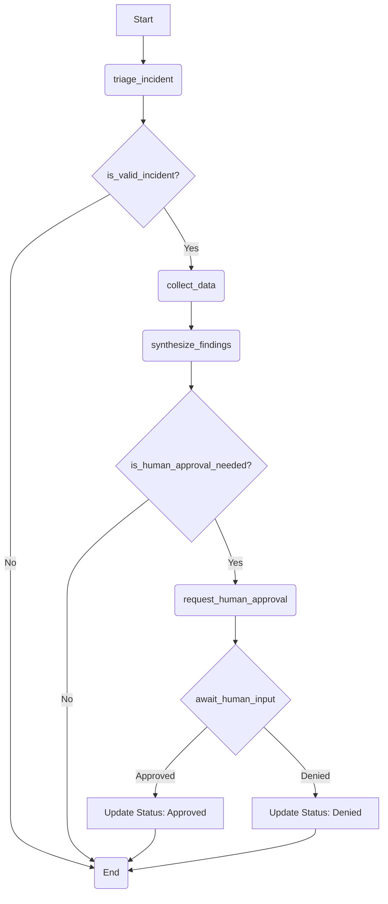

# Architect Agent: Research

## Question 1

> *research create the technical design for the newly added Epic 4. I want specific details of how you're going to use
Lanngraph to model the workflow as a graph of agents and how you're going to enable human-in-the-loop. I want to see
specific details about the agents you're goign to use

Understood. You want to create a detailed technical design for the MCP server integration, focusing on LangGraph and
human-in-the-loop workflows.

I will use the *research command to facilitate this. This command will guide us through the process of creating a
comprehensive and well-structured research prompt. The output will be a detailed prompt that you can then use with an AI
research assistant or as a guide for manual research.

First, let's select the most appropriate research focus. Based on your request, Option 5 seems like the best fit.

Please confirm from the list below, or choose a different one if you feel it's more appropriate:

1. Product Validation Research
2. Market Opportunity Research
3. User & Customer Research
4. Competitive Intelligence Research
5. Technology & Innovation Research
6. Industry & Ecosystem Research
7. Strategic Options Research
8. Risk & Feasibility Research
9. Custom Research Focus

## Choice

> 5

✦ Excellent. We'll proceed with Technology & Innovation Research.

Now, we will collaboratively build the research prompt section by section. Let's start with the Research Objectives.

Based on your request, I've drafted the primary objective. Please review it and then provide the Success Criteria and any
Constraints.

> Ran out of tokens here - restarted


I have compiled all the sections we've discussed into the final, complete
research prompt.

Here is the full document for your review and approval.

  ---

Research Objective

To create a detailed technical design for the SRE Orchestrator's integration with a Model Context Protocol (MCP)
server. This design must specify:
1. How to use the LangGraph framework to model SRE workflows (e.g., incident triage) as a graph of interconnected
   agents.
2. The specific design of the agents to be used in this graph.
3. A clear mechanism for enabling "human-in-the-loop" (HITL) verification at critical steps in the workflow.

Background Context

The SRE Orchestrator needs an extensible method for integrating with external SRE tools. The chosen approach is to use
LangGraph to build intelligent agents and the Model Context Protocol (MCP) to provide a standardized interface to
tools. This research will produce the technical blueprint for the initial agentic workflow.

Research Questions

Primary Questions (Must Answer)

1. LangGraph Architecture:
    * What is the optimal graph structure for a generic SRE incident triage workflow? (e.g., Should it be a linear
      sequence, a tree, or a more complex cyclic graph?)
    * What are the specific nodes (agents) and edges (transitions) in this graph?
    * How will the state of the graph be managed throughout the lifecycle of an incident?

2. Agent Design:
    * What are the specific roles, prompts, and tools for the initial set of agents? We will start with:
        * A "Triage Agent": Responsible for initial analysis of an alert and routing it to the correct workflow.
        * A "Data Collection Agent": Responsible for querying data sources (via MCP) like Prometheus or logs to enrich
          the incident context.
        * A "Synthesis Agent": Responsible for summarizing the collected data and proposing a root cause hypothesis.
    * How will these agents communicate and pass information to each other?

3. Human-in-the-Loop (HITL) Mechanism:
    * At which points in the graph should the workflow pause for human approval? (e.g., Before running a potentially
      disruptive diagnostic command? Before escalating a ticket?)
    * What is the technical design for the HITL interface? (e.g., How does a human receive the request and provide a
      response? Via a REST API endpoint? A message to a Slack channel?)
    * How does the graph resume or change course based on the human's feedback (e.g., "approved," "denied," "provide
      more information")?

Research Methodology

Information Sources

* Primary: LangChain and LangGraph official documentation.
* Secondary: Blog posts, tutorials, and example projects demonstrating agentic workflows and human-in-the-loop patterns
  with LangGraph.
* Tertiary: Documentation for the Model Context Protocol (MCP) to ensure the proposed design is compatible.

Analysis Frameworks

* The research should compare at least two different graph structures for the triage workflow (e.g., a simple sequential
  chain vs. a graph with conditional branching).
* The final design will be evaluated against our core architectural principles of "Living Architecture" and "Progressive
  Complexity."

Expected Deliverables

Format Specifications

The final output must be a markdown document suitable for inclusion in our project's architecture documentation
(docs/architecture/).

Key Deliverables

* An Executive Summary explaining the proposed design in plain language.
* A Detailed Design section containing:
    * A MermaidJS diagram of the LangGraph graph.
    * Detailed descriptions of each agent's role, prompt, and tools.
    * A sequence diagram illustrating the Human-in-the-Loop interaction flow.
    * Example code snippets for the core graph and agent definitions.
* A Next Steps section outlining a high-level implementation plan.

Success Criteria

* The final design document includes a clear diagram of the LangGraph agent graph.
* The design specifies the prompts and tools for at least two distinct agent roles (e.g., a "Triage Agent" and a "Data
  Collection Agent").
* The Human-in-the-Loop (HITL) mechanism is clearly defined with an example interaction flow.
* The design is sufficiently detailed to be handed off to a development team for implementation planning.

Constraints

* The proposed solution should prioritize asynchronous communication to handle potentially long-running SRE tasks.
* The design should be modular, allowing new agents or tools to be added with minimal changes to the core graph
  structure.

  ---

This completes the *research task. You can now use this comprehensive prompt to guide your research.

Once you have the answers, I can help you draft the official architecture document. What would you like to do next?

## Question 2

> I like the research agenda you have given. What is the expected next step? Are you going to do this research or do you
need the answers from me?

✦ That's an excellent clarifying question.

The *research command is designed to help you, the user, structure your own investigation by producing a comprehensive
prompt or research plan. The intention is that you would take this plan and use it to conduct the research yourself,
either through web searches, reading documentation, or using other AI tools.

I do not have the capability to perform that deep-level research and synthesis myself. My role as the Architect
persona is to help you structure the problem, define the architectural requirements, and then document the resulting
design.

So, the expected next step is for you to find the answers to the questions in the research prompt.

Once you have those answers, I can then help you with the next logical step, which would be to draft the official
architecture document based on your findings. For example, you could come back and say, "Winston, I've completed the
research, and I've decided on the graph structure. Let's create the architecture document," and we could then use the
*create-backend-architecture command.

Does that make sense?


## Question 3

> OK I'm trying to design a langgraph graph structure for a generic SRE incident triage workflow. Can you help me with it? I
already have an Incident defintion in @services/orchestrator/src/app/models/incidents.py - please reuse this

✦ Of course. This is the perfect next step. I can help you design a LangGraph structure for your SRE triage workflow, and
I will absolutely reuse the Incident model you've provided. That will be the core data structure that flows through our
graph.

Here is a proposed design for the graph.

1. Graph State

First, we define the "state" of our graph. This is the central object that each agent will modify. It will hold the
Incident data.

    1 from typing import TypedDict
    2 from .models.incidents import Incident
    3 
    4 class GraphState(TypedDict):
    5     """
    6     Represents the state of our graph.
    7 
    8     Attributes:
    9         incident: The core incident object being processed.
10     """
11     incident: Incident

2. Graph Nodes (The Agents)

Next, we define the nodes in our graph. Each node represents an agent or a specific function that performs a task.

1. `triage_incident`:
    * Purpose: The entry point. It takes the initial incident description, creates the Incident object, and performs a
      basic analysis.
    * Output: Updates the incident.status to "triaging" and adds initial extracted entities to
      incident.extracted_entities.

2. `collect_data`:
    * Purpose: This is the Data Collection Agent. Based on the initial triage, it queries external tools (via the MCP
      Server) like logging platforms or metrics dashboards to gather relevant evidence.
    * Output: Populates the incident.evidence dictionary with the data it collected.

3. `synthesize_findings`:
    * Purpose: This is the Synthesis Agent. It reviews all the data in incident.evidence and attempts to generate a
      hypothesis.
    * Output: Updates the incident.suggested_root_cause and incident.confidence_score.

4. `request_human_approval`:
    * Purpose: This is our Human-in-the-Loop (HITL) entry point. It takes the synthesized findings and presents them to
      a human for verification. The graph will pause at this node, awaiting external input.
    * Output: The incident.status is changed to "pending_approval".

3. Graph Edges (The Workflow Logic)

Finally, we define the edges that connect the nodes. This is the logic of our workflow.




Workflow Explanation:

1. An incident starts the graph, triggering the `triage_incident` node.
2. A conditional edge checks if the incident is valid. If not, the workflow ends.
3. If valid, the `collect_data` agent gathers evidence.
4. The `synthesize_findings` agent creates a hypothesis.
5. A conditional edge checks if human approval is required (e.g., based on the confidence score or incident severity).
6. If approval is needed, the `request_human_approval` node is called, and the graph pauses.
7. The graph waits for a human to provide input ("Approved" or "Denied").
8. Based on the input, the incident status is updated, and the workflow concludes.

This structure provides a robust starting point. It directly uses your Incident model, incorporates the agent concepts
we discussed, and includes a clear mechanism for human-in-the-loop verification.

What are your thoughts on this proposed design?


## Question 4

> this looks good but how would thsi translate in to a LangGraph implementation?

✦ Excellent question. Translating the design into a LangGraph implementation is the next logical step. Here’s how the 
  concepts we've discussed map directly to the LangGraph library, with some illustrative Python code.

1. Defining the Graph State

  As we defined before, you start with your TypedDict for the state. This is a core part of LangGraph.

```python
from typing import TypedDict
from .models.incidents import Incident

class GraphState(TypedDict):
    incident: Incident
```

2. Implementing the Nodes (Agents)

  Each node in our diagram becomes a Python function that takes the GraphState as input and returns a dictionary with 
  the modified state.

```python

def triage_incident(state: GraphState) -> dict:
    """
    Node that performs initial triage on the incident.
    """
    print("---TRIAGING INCIDENT---")
    incident = state['incident']
    # ... implementation for triage logic ...
    # (e.g., analyze description, extract entities)
    incident.status = "triaging"
    return {"incident": incident}
 
def collect_data(state: GraphState) -> dict:
    """
    Node that collects data from external tools.
    """
    print("---COLLECTING DATA---")
    incident = state['incident']
    # ... implementation for data collection via MCP ...
    # (e.g., query Prometheus, search logs)
    incident.evidence['logs'] = "Example log data..."
    return {"incident": incident}
 
def synthesize_findings(state: GraphState) -> dict:
    """
    Node that synthesizes collected data into a hypothesis.
    """
    print("---SYNTHESIZING FINDINGS---")
    incident = state['incident']
    # ... implementation for synthesis logic ...
    # (e.g., use an LLM to analyze evidence)
    incident.suggested_root_cause = "Database connection pool exhaustion."
    incident.confidence_score = "high"
    incident.status = "pending_approval"
    return {"incident": incident}

# This node doesn't modify state, it just signals a pause
def request_human_approval(state: GraphState) -> dict:
    """
    Node that signals the graph to pause for human input.
    """
    print("---REQUESTING HUMAN APPROVAL---")
    return {}

```

3. Implementing the Conditional Edges

The diamonds in our diagram are functions that determine which path to take next. They return the name of the next 
node to execute.

```python
def is_valid_incident(state: GraphState) -> str:
    """
    Determines if the incident is valid enough to proceed.
    """
    print("---CHECKING INCIDENT VALIDITY---")
    if state['incident'].description:
        return "collect_data"  # If valid, go to data collection
    return "end"  # Otherwise, end the workflow

def is_human_approval_needed(state: GraphState) -> str:
    """
    Determines if the hypothesis requires human sign-off.
    """
    print("---CHECKING IF HUMAN APPROVAL IS NEEDED---")
    if state['incident'].confidence_score == "high":
        return "end"  # If confidence is high, we can end
    return "request_human_approval" # Otherwise, pause for a human
```


4. Assembling the Graph

  Now, you put it all together. You define the graph, add the nodes, and wire them up with the edges.

```python

from langgraph.graph import StateGraph, END

# 1. Initialize the graph
workflow = StateGraph(GraphState)

# 2. Add the nodes
workflow.add_node("triage_incident", triage_incident)
workflow.add_node("collect_data", collect_data)
workflow.add_node("synthesize_findings", synthesize_findings)
workflow.add_node("request_human_approval", request_human_approval)

# 3. Set the entry point
workflow.set_entry_point("triage_incident")

# 4. Add the edges
workflow.add_conditional_edges(
    "triage_incident",
    is_valid_incident,
    {
     "collect_data": "collect_data",
     "end": END
    }
)
workflow.add_edge("collect_data", "synthesize_findings")
workflow.add_conditional_edges(
    "synthesize_findings",
    is_human_approval_needed,
    {
     "request_human_approval": "request_human_approval",
     "end": END
    }
)
```

5. Handling the Human-in-the-Loop Pause

  This is the crucial part. You interrupt the graph at the request_human_approval node. LangGraph has built-in support 
  for this.

```python
# In your graph assembly code, you add an interrupt
workflow.add_node("request_human_approval", request_human_approval).add_edge(
 "request_human_approval", END # Temporarily end here to pause
)

# Compile the graph
app = workflow.compile(checkpointer=...) # A checkpointer is needed for pauses

# --- In your application code that runs the graph ---

# This is pseudo-code to illustrate the concept
config = {"configurable": {"thread_id": "some_incident_id"}}
initial_state = {"incident": Incident(description="...")}

# Run the graph until it pauses
for output in app.stream(initial_state, config=config):
 # The graph is now paused at the 'request_human_approval' step
 # The 'output' variable contains the current state
 print(output)

# --- Later, after a human provides feedback ---

# You can resume the graph from its paused state
# For example, if the human approved:
app.update_state(config, {"incident": {"status": "approved"}})
```

This implementation directly mirrors the diagram. The code defines the nodes and edges, and the stream and 
update_state methods are how you manage the pause-and-resume cycle for human feedback.
