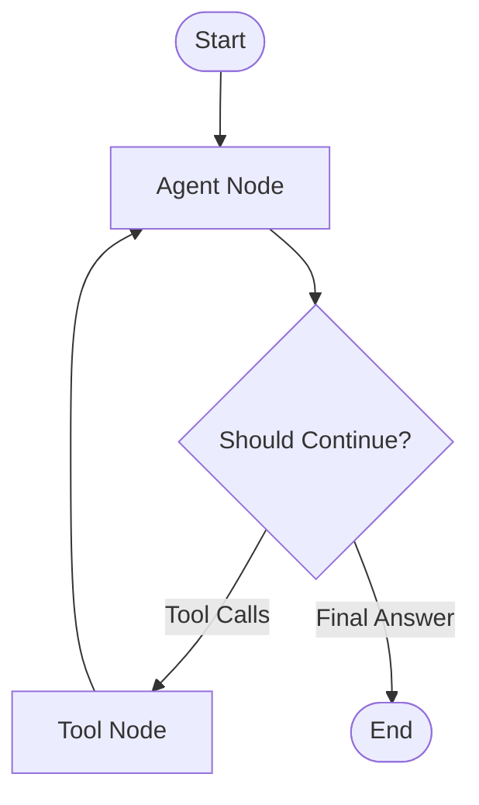

### Story

As a Developer, I want to refactor the investigation agent from using LangChain's prebuilt `create_agent` function to a native LangGraph StateGraph implementation, so that I have full control over the workflow and can customize it for future needs.

### Acceptance Criteria

1. The investigation agent uses LangGraph's StateGraph class for workflow definition
2. The system does not use `create_agent` or `create_react_agent` prebuilt functions
3. The StateGraph defines explicit nodes for agent reasoning and tool execution
4. The StateGraph defines explicit edges for workflow transitions
5. The StateGraph maintains the same ReAct pattern behavior as the current implementation
6. A feature flag (USE_NATIVE_LANGGRAPH) enables switching between implementations
7. The native graph is created with a dedicated `create_investigation_agent_native` function

### Dev Notes

#### Why Native LangGraph?

The current implementation uses LangChain's prebuilt agent functions, which are convenient but limit our ability to:
- Customize the workflow (e.g., add validation steps, multi-phase investigation)
- Implement advanced routing logic (e.g., confidence thresholds, early termination)
- Add human-in-the-loop patterns
- Debug and understand the agent's decision-making process

A native StateGraph implementation provides explicit control over:
- State schema and management
- Node execution logic
- Edge routing decisions
- Error handling at each step
- Logging and observability

[Source: `.kiro/specs/native-langgraph-refactoring/requirements.md` Requirement 1]

#### Graph Structure



[Source: `.kiro/specs/native-langgraph-refactoring/design.md`]

#### Implementation Approach

1. **Create parallel implementation**: Build native graph alongside existing prebuilt agent
2. **Feature flag**: Use USE_NATIVE_LANGGRAPH env var to switch between implementations
3. **Maintain compatibility**: Ensure same input/output structure
4. **Test thoroughly**: Validate behavior matches prebuilt agent
5. **Gradual rollout**: Enable feature flag after validation

[Source: `.kiro/specs/native-langgraph-refactoring/design.md` Migration Path]

#### Key Components

**StateGraph Setup:**
```python
from langgraph.graph import StateGraph, END

graph = StateGraph(InvestigationState)
graph.add_node("agent", agent_node)
graph.add_node("tools", ToolNode(mcp_tools))
graph.add_conditional_edges("agent", should_continue, {
    "tools": "tools",
    "end": END
})
graph.add_edge("tools", "agent")
graph.set_entry_point("agent")
agent = graph.compile()
```

**Feature Flag Logic:**
```python
async def create_investigation_agent(mcp_tools, llm_config, correlation_id):
    use_native = os.getenv("USE_NATIVE_LANGGRAPH", "false").lower() == "true"

    if use_native:
        return await create_investigation_agent_native(
            mcp_tools, llm_config, correlation_id
        )
    else:
        # Existing prebuilt agent implementation
        return await create_investigation_agent_prebuilt(
            mcp_tools, llm_config, correlation_id
        )
```

[Source: `.kiro/specs/native-langgraph-refactoring/tasks.md` Task 7]

### Tasks / Subtasks

- [x] **(AC: 1, 3, 4)** **Implement Graph Construction Function:**
  - Create `create_investigation_agent_native` function in investigation_agent.py
  - Initialize StateGraph with InvestigationState schema
  - Add agent node and tool node to graph
  - Add conditional edges from agent using should_continue routing
  - Add edge from tools back to agent
  - Set entry point to agent node
  - Reference: `.kiro/specs/native-langgraph-refactoring/tasks.md` Task 5

- [x] **(AC: 5)** **Compile Graph:**
  - Call graph.compile() to create executable agent
  - Add error handling for graph construction failures
  - Add logging for successful compilation
  - Return compiled agent
  - Reference: `.kiro/specs/native-langgraph-refactoring/tasks.md` Task 5.3

- [x] **(AC: 6, 7)** **Add Feature Flag:**
  - Add USE_NATIVE_LANGGRAPH environment variable to config.py
  - Default to False (use current prebuilt implementation)
  - Update create_investigation_agent to check flag
  - Call create_investigation_agent_native if True
  - Log which implementation is used
  - Reference: `.kiro/specs/native-langgraph-refactoring/tasks.md` Task 7

- [x] **(AC: 2)** **Remove Prebuilt Agent Usage:**
  - Ensure create_investigation_agent_native does NOT use create_agent
  - Ensure create_investigation_agent_native does NOT use create_react_agent
  - Use only native StateGraph APIs
  - Reference: `.kiro/specs/native-langgraph-refactoring/requirements.md` Requirement 1.2

- [x] **Update Environment Configuration:**
  - Add USE_NATIVE_LANGGRAPH to .env.example
  - Document the feature flag in README.md
  - Add inline comments explaining the flag's purpose
  - Reference: `.kiro/specs/native-langgraph-refactoring/tasks.md` Task 7.1

- [x] **Unit Tests:**
  - Test graph construction succeeds
  - Test graph has correct nodes and edges
  - Test feature flag switches implementations
  - Verify logging during graph creation
  - Reference: `.kiro/specs/native-langgraph-refactoring/tasks.md` Task 8.4

### Change Log

| Date | Version | Description | Author |
| --- | --- | --- | --- |
| 2025-11-15 | 1.0 | Initial draft | Yi (Dev) |

### Dev Agent Record

#### Agent Model Used
Claude Sonnet 4.5

#### Debug Log References
_TBD_

#### Completion Notes List
- Native StateGraph implementation provides explicit control over workflow
- Feature flag enables safe rollout and easy rollback
- Graph compilation includes error handling and logging
- State schema defined in separate story (5.14)
- Nodes implemented in separate story (5.15)

#### File List
- investigation_agent.py: create_investigation_agent_native function
- config.py: USE_NATIVE_LANGGRAPH environment variable
- .env.example: Feature flag documentation

### QA Results

- **Status:** Not yet reviewed
- **Date:**
- **Reviewed by:**
- **Summary:**
- **Issues Found:**
- **Recommendations:**
